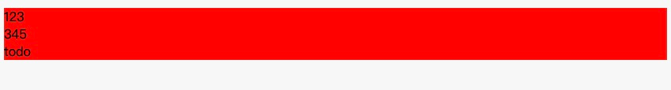

### 原生css
```html
<div>
    <div class="test">
      123
      <div class="test22">345</div>
      <div class="todo">todo</div>
    </div>
  </div>
```
`div.test` 表示同时带有 `div` 和 `.test`选择器
`div .test` 表示后代选择器即div的所有子元素中带有`.test`选择器的元素

`div > .test` 表示`div`下一代元素(不包含子孙元素)带有`.test`选择器的元素
```css
div.test{
  color: red;
}
```


