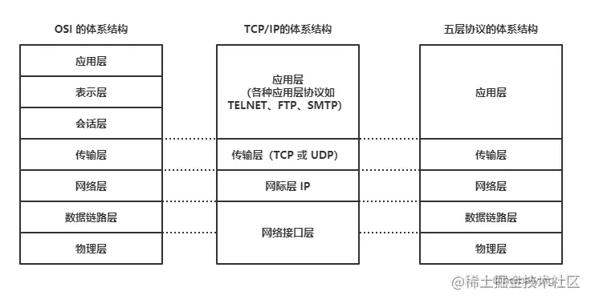
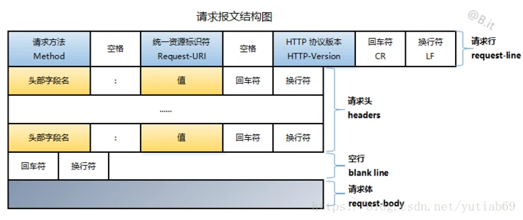
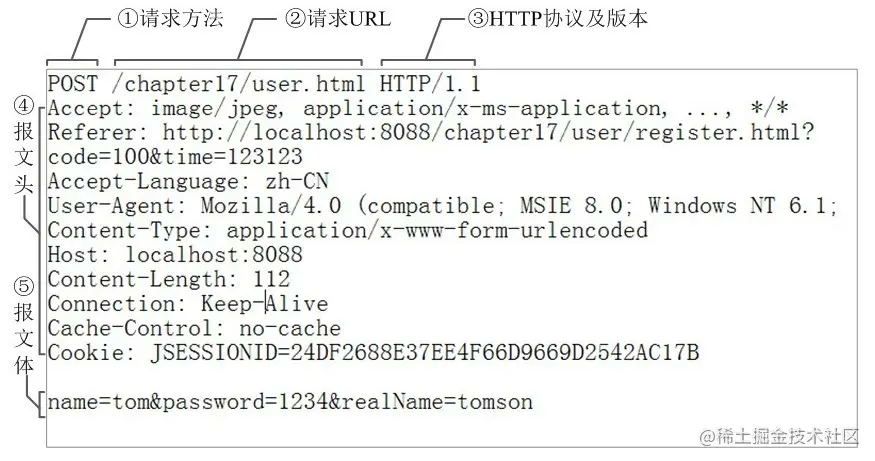
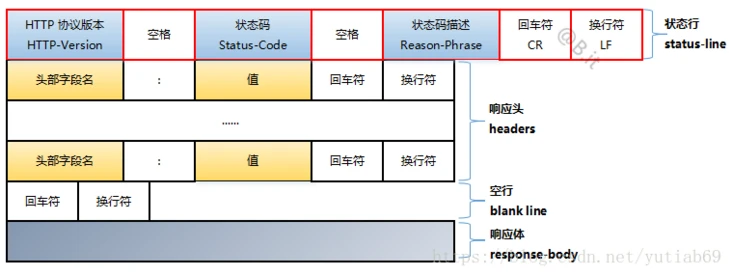
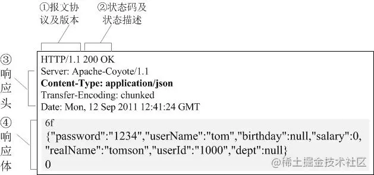

  

## 计算机网络模型/结构
计算机网络的整个架构可以大致概括成三个模型[^1],即:  
- 七层模型的OSI(Open System Interconnection Mode)模型  
- 四层模型的TCP/IP模型  
- 五层模型的TCP/IP模型  

七层模型是教科书或者说理论上的一个标准的模型。  
五层模型则是在实际软件开发过程中运用最广泛的一个模型,也可以说是一个事实标准.它简化了OSI模型的应用层,表示层,会话层,将它合并为一个应用层。  
对于我们前端开发来说,网际层,数据链路层,物理层不是我们关注的重点,而是聚焦于五层模型的应用层和传输层上,这也是我们最常接触的部分。    

## HTTP协议  

### HTTP协议发展史[^2]  
- HTTP/0.9  
HTTP的1991原型版本称为HTTP/0.9。这个协议有很多严重的设计缺陷，只应该用于与老客户端的交互。HTTP/0.9只支持GET方法，不支持多媒体内容的MIME类型、各种HTTP首部，或者版本号。HTTP/0.9定义的初衷是为了获取简单的HTML对象，它很快就被HTTP/1.0取代了。  
  

- HTTP/1.0  
1.0是第一个得到广泛使用的HTTP版本。HTTP/1.0添加了版本号、各种HTTP首部、一些额外的方法，以及对多媒体对象的处理。HTTP/1.0使得包含生动图片的Web页面和交互式表格成为可能，而这些页面和表格促使万维网为人们广泛地接受。这个规范从未得到良好地说明。在这个HTTP协议的商业演进和学术研究都在快速进行的时代，它集合了一系列的最佳实践。  
  

- HTTP/1.0+  
在20世纪90年代中叶，很多流行的Web客户端和服务器都在飞快地向HTTP中添加各种特性，以满足快速扩张且在商业上十分成功的万维网的需要。其中很多特性，包括持久的keep-alive连接、虚拟主机支持，以及代理连接支持都被加入到HTTP之中，并成为非官方的事实标准。这种非正式的HTTP扩展版本通常称为HTTP/1.0+。  
  

- HTTP/1.1  
HTTP/1.1重点关注的是校正HTTP设计中的结构性缺陷，明确语义，引入重要的性能优化措施，并删除一些不好的特性。HTTP/1.1还包含了对20世纪90年代末正在发展中的更复杂的Web应用程序和部署方式的支持。HTTP/1.1是当前使用的HTTP版本。  
  

- HTTP-NG（又名HTTP/2.0）  
HTTP-NG是HTTP/1.1后继结构的原型建议，它重点关注的是性能的大幅优化，以及更强大的服务逻辑远程执行框架。随着 2015 年 5 月 14 日 HTTP/2 协议正式版的发布，越来越多的网站和第三方 CDN 服务开始启用 HTTP/2。HTTP/2 是新一代的 HTTP。

### HTTP协议结构  
HTTP协议的结构大致如下

第一行: 标记这是一个http request或者response  
第二行: 包含了请求或者响应的一些信息,key:value形式  
第三行: 用来分隔header和body  
第四行: 包含了请求或者响应的主体  

具体如下图所示
#### 请求
[^3]  
  
请求行+请求头+空行+请求体  

实例:  
[^4]

#### 响应  
[^3]  
状态行+响应头+空行+响应体

实例:  
[^4]

#### HTTP协议特征
1. 明文的,不安全的  
我们能直接看懂传输的内容,但同时无法验证通信双方的身份，也不能判断报文是否被修改  
  

2. 请求-应答通信模式  
这个请求 - 应答模式是 HTTP 协议最根本的通信模型，通俗来讲就是“一发一收”“有来有去”，就像是写代码时的函数调用，只要填好请求头里的字段，“调用”后就会收到答复。  
  

3. 灵活可扩展   
HTTP 协议最初诞生的时候就比较简单，本着开放的精神只规定了报文的基本格式，比如用空格分隔单词，用换行分隔字段，“header+body”等，报文里的各个组成部分都没有做严格的语法语义限制，可以由开发者任意定制。 所以，HTTP 协议就随着互联网的发展一同成长起来了。在这个过程中，HTTP 协议逐渐增加了请求方法、版本号、状态码、头字段等特性。而 body 也不再限于文本形式的 TXT 或 HTML，而是能够传输图片、音频视频等任意数据，这些都是源于它的“灵活可扩展”的特点。[^5]
  

4. 可靠  
因为HTTP协议是基于TCP/IP的，而TCP本身是一个“可靠”的传输协议，所以HTTP自然也就继承了这个特性，能够在请求方和答应发之间“可靠”的传输数据。其实HTTP也就是对传输的数据进行了一层包装，加上一个头，然后调用Socket API，通过TCP/IP协议发送和接收。  
  

5. 无状态
HTTP是一种不保存状态，即无状态（stateless）协议。HTTP协议自身不对请求和响应之间的通信状态进行保存。也就是说在HTTP这个级别，协议对于发送过的请求或响应都不做持久化处理。HTTP协议自身不具备保存之前发送过的请求或响应的功能使用HTTP协议，每当有新的请求发送时，就会有对应的新响应产生。协议本身并不保留之前一切的请求或响应报文的信息。这是为了更快地处理大量事务，确保协议的可伸缩性，而特意把HTTP协议设计成如此简单的。[^6]

## 参考文章
[^1]:[详解 四层、五层、七层 计算机网络模型](https://juejin.cn/post/6844904049800642568#heading-0)  
[^2]:HTTP权威指南  
[^3]:[浅谈http协议（三）：HTTP 报文及其结构](https://segmentfault.com/a/1190000019788537)  
[^4]:[HTTP协议的特点、HTTP报文的组成部分](https://juejin.cn/post/7007596073426370568)  
[^5]:[HTTP有哪些特点](https://juejin.cn/post/6992082647124525093)  
[^6]:图解HTTP 

