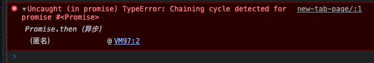
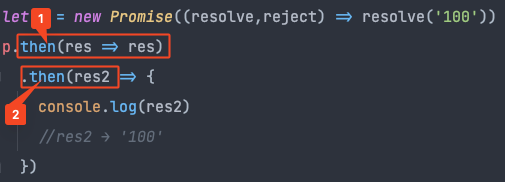
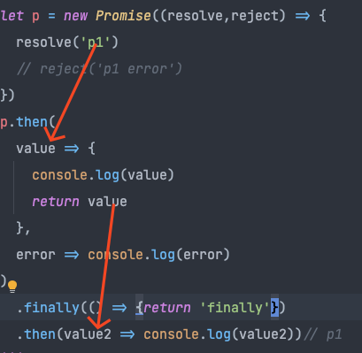

日常开发中,我们经常会使用到`Promise`,今天我们就来揭开它的神秘面纱,看看它的内部是如何实现的

:::tip
重复的代码我就不贴了,统一用/*---省略---*/表示,只需要关注改变的代码即可。
:::

## 一个最基本的Promise
实现某某函数,我们一般可以从他是怎么用的开始入手
一般我们会这么使用`Promise`:
```javascript
//index.js
let promise = new Promise((resolve,reject) => {})
```
从这一行代码,我们就能发现:
1. `Promise`是一个类
2. 初始化`Promise`这个类时需要传递一个执行函数,这个执行函数有两个参数,当然,根据我们的常识,这两个参数也都是函数
好,我们就先从这一步开始,写一个我们自己的`Promise`,代码如下:
```javascript
//myPromise.js
class myPromise {
  constructor(fn) {
    fn(this.resolve,this.reject)
  }
  resolve = () => {}
  reject = () => {}
}
```
接下来,让我们再回忆一下,`Promise`的这个执行器内我们又会写什么代码呢?
```javascript
let promise = new Promise((resolve,reject) => {
  //成功时
  resolve('成功了')
  //失败时
  reject(new Error())
})
```
上面的使用`Promise`的代码,说明`Promise`使用时的几个特点:
1. 成功调用`resolve()`,如果有需要可以传递一个值给`resolve()`
2. 失败调用`reject()`,一般这时会将`new Error()`当做参数传给`reject()`
3. 同时还有个隐性的特点,`Promise`的状态一旦从`pending`变为`fulfilled`或者`rejected`,`Promise`的状态就不能再被改变了,也就是说,上面的代码虽然同时调用了`resolve()`和`reject()`,但只有`resolve()`会被调用.反过来,`reject()`先调用,那么`resolve()`也不会被调用.不清楚的小伙伴可以自己去试试哦  
  

好,我们继续按照我们刚才总结的`Promise`特点,继续写`myPromise`的代码

```javascript
//myPromise.js
const PENDING = 'pending'
const FULFILLED = 'fulfilled'
const REJECTED = 'rejected'
class myPromise {
  status = PENDING
  value = undefined
  reason = undefined
  constructor(fn) {
    fn(this.resolve,this.reject)
  }
  resolve = (value) => {
    if (this.status !== PENDING) return//如果fulfilled或者rejected就返回
    this.status = FULFILLED
    this.value = value
  }
  reject = (reason) => {
    if (this.status !== PENDING) return//同上
    this.status = REJECTED
    this.reason = reason
  }
}
```
ok,easy!那`Promise`最重要的一个特点`then`的链式调用,解决了之前js一个很大的痛点:回调地狱。  
那么,`then()`又是怎么实现的呢?同样的,我们先看看我们平时用的`Promise`是怎么使用`then()`的
```javascript
let promise = new myPromise((resolve,reject) => {
  resolve('成功')
})
 promise.then(
   res => {
     console.log(res,'res')
   },
   error => {
     console.log(error,'error')
   })
```
`then()`接受两个参数,一个表示成功之后的回调函数,一个表示失败之后的回调函数。  
同时这两个函数都会接收`resolve()`/`reject()`传递过来的值。
```javascript
//myPromise.js
const PENDING = 'pending'
const FULFILLED = 'fulfilled'
const REJECTED = 'rejected'
class myPromise {
  status = PENDING
  value = undefined
  reason = undefined
  constructor(fn) {
    fn(this.resolve,this.reject)
  }
  /* ---省略--- */
  then(success,error){
    if (this.status === FULFILLED) {
      success(this.value)
    }
    if (this.status === REJECTED) {
      error(this.reason)
    }
  }
}
```
ok!到这里,我们已经实现了一个简易的`Promise`了。

## 处理异步逻辑的`myPromise`
刚才我们实现的`myPromise`处理同步的代码是没有问题的,但处理异步逻辑的代码就会出问题了:
```javascript
let promise = new myPromise((resolve,reject) => {
  setTimeout(() => {
    resolve('setTimeout go')
  },5000)
})
promise.then(res => {
  console.log(res,'res')
})
```
根据我们刚才构造的`myPromise`函数,`new myPromise`之后,`setTimeout`中的代码不会立即执行,而是继续执行下面的`promise.then()`。  
所以,`myPromise`还需要对异步逻辑进行处理。  
`setTimeout`触发异步逻辑后,`myPromise`的状态因为并没有执行`resolve()`而停留在`pending`状态,所以在`then()`中我们要增加对`pending`状态的处理。

```javascript
//myPromise.js
const PENDING = 'pending'
class myPromise {
  /* ---省略--- */
  then(success,fail){
    /* ---省略--- */
    if (this.status === PENDING) {
      //异步逻辑不会立马改变promise的状态,即既不会是fulfilled也不会是rejected
      //所以在pending这里对异步逻辑进行保存,等待promise状态改变再执行
      this.successCB = success
      this.failCB = fail
    }
  }
}
```
这样,`myPromise`就能处理异步的函数了。

## then()的多次调用
但这样写的`then`函数会有一个问题,我们在使用Promise的时候,经常会多次调用`Promise.then()`方法,这时候我们让`this.successCB = success`就有问题了。
```javascript
let promise = new myPromise((resolve,reject) => {
  setTimeout(() => {
    resolve('async logic')
  },3000)
})
promise.then(res => {
  console.log(res,'res')
})
promise.then(res => {
  console.log(res,'res')
})
promise.then(res => {
  console.log(res,'res')
})
```
所以,我们得把`successCB`和`failCB`更改为数组, 如果发现执行逻辑是异步的,就将执行逻辑push进`successCB`/`failCB`中,等`pending状态`变为`fulfilled`/`rejected`之后,将执行逻辑从数组`successCB`/`failCB`中弹出并执行。  
话不多说,还是代码最能说明问题:
```javascript
/* ---省略--- */
class myPromise {
  /* ---省略--- */
  // successCB = undefined
  // failCB = undefined
  successCB = [] //为了实现then的多次调用改为数组
  failCB = [] // 同上
  constructor(fn) {
    fn(this.resolve,this.reject)
  }
  resolve = (value) => {
    /* ---省略--- */
    // this.successCB && this.successCB(this.value)
    //多次调用then
    while (this.successCB.length) this.successCB.shift()(this.value)
  }
  reject = (reason) => {
    /* ---省略--- */
    // this.failCB && this.failCB(this.reason)
    //多次调用then
    while (this.failCB.length) this.failCB.shift()(this.reason)
  }
  then(success,fail){
    /* ---省略--- */
    if (this.status === PENDING) {
      this.successCB.push(success)
      this.failCB.push(fail)
    }
  }
}
```
## then()的链式调用
### 分析
#### 1. `Promise`允许我们使用`then()`,并且支持链式调用,链式调用的`then()`接收上一个`Promise`函数的返回值
```javascript
let p = new Promise((resolve,reject) => resolve('100'))
p.then(res => res)
  .then(res2 => {
    console.log(res2)
    //res2 → '100'
  })
```
#### 2. `then()`的回调函数的返回值,既可以是`Promise`,也可以是其他普通值,要判断并分别处理
#### 3. 如果`then()`的回调函数的返回值是`then()`返回的那个`Promise`,应该抛出一个错误。


```javascript
let p = new Promise((resolve,reject) => resolve('100'))
let p1 = p.then(res => {
  return p1
  //Uncaught (in promise) TypeError: Chaining cycle detected for promise #<Promise>
})
```

### 实现
#### 1. 链式调用:`return`一个新的`myPromise`即可
```javascript
class myPromise {
  /* ---省略--- */
  then(success,fail){
    return myPromise((resolve,reject) => {
      /* ---省略--- */
    })
  }
}
```
链式调用还需要接收上一个Promise函数的返回值
  
如图所示,我们需要将`then1`的执行结果传递给`then2`,只需要调用`then1`返回的Promise的`resolve()`方法,`then1`的执行结果就会保存在`class myPromise`的`value`中;  
`then2`就可以通过`this.value`获取到`then1`传递过来的执行结果了

```javascript
//myPromise.js
/* ---省略--- */
class myPromise {
  /* ---省略--- */
  then(success,error){
    return myPromise((resolve,reject) => {
      /* ---省略--- */
      if (this.status === FULFILLED) {
        // success(this.value)
        let xxx = success(this.value)
        resolve(xxx)
      }
      if (this.status === REJECTED) {
        error(this.reason)
      }
    })
  }
}
```
#### 2. 上面的代码中`xxx`这个变量代表的就是`then()`回调函数所返回的值,所以这里我们要对它进一步判断处理
```javascript
//myPromise.js
class myPromise {
  /* ---省略--- */
  then(success,error){
    return myPromise((resolve,reject) => {
      if (this.status === FULFILLED) {
        let xxx = success(this.value)
        resolvePromise(xxx,resolve,reject)
      }
      if (this.status === REJECTED) {
        let xxx = error(this.reason)
        resolvePromise(xxx,resolve,reject)
      }
      /* ---省略--- */
    })
  }
}
function resolvePromise (xxx, resolve,reject) {
  if (xxx instanceof myPromise) {
    //如果返回的是promise,将成功/失败继续往下传递
    // xxx.then(value => resolve(value),reason => reject(reason))
    //简写↓
    xxx.then(resolve,reject)
  }else {
    resolve(xxx)
  }
}
```
帮助函数`resolvePromise`的逻辑很简单:
1. 判断`xxx`是普通值还是`Promise对象`
2. 如果`xxx`是`Promise实例`,调用`xxx.then()`,返回成功就走`resolve`,反之走`reject`
3. 如果不是,直接`resolve(xxx)`,将`xxx`这个返回值传递下去

#### 3. 判断`xxx`是否循环调用
```javascript
//myPromise.js
class myPromise {
  /* ---省略--- */
  then(success,error){
    let p = myPromise((resolve,reject) => {
      if (this.status === FULFILLED) {
        let xxx = success(this.value)
        resolvePromise(p,xxx,resolve,reject)
      }
      /* ---省略--- */
    })
  }
}
function resolvePromise (p, xxx, resolve,reject) {
  if(p === xxx) reject(new TypeError('不能返回自身'))
  /* ---省略--- */
}
```
如果`p`和`xxx`相等,直接`reject`返回一个`TypeError`

#### 4. p的获取时机
按照之前我们的分析,写到这里应该就实现功能了。  
但上面的代码隐藏了一个bug: 我们在向`resolvePromise()`传递`p`时,仔细想一想,这时的`p`创建了吗?  
熟悉Js异步机制的小伙伴应该反应过来了,这时候`p`根本就没创建嘛。
我们对代码做出如下改动就能解决这个问题:
```javascript

//myPromise.js
class myPromise {
  /* ---省略--- */
  then(success,error){
    let p = myPromise((resolve,reject) => {
      if (this.status === FULFILLED) {
        setTimeout(() => {
          let xxx = success(this.value)
          resolvePromise(p,xxx,resolve,reject)
        },0)
      }
      /* ---省略--- */
    })
  }
}
/* ---省略--- */
```
`setTimeout`让代码变成异步逻辑,等`p`创建好之后,在执行`setTimeout`回调函数里面的代码  
:::tip
记得把FULFILLED,REJECTED,PENDING都加上`setTimeout()`哦
:::


## 捕获错误
#### 执行器错误捕获
```javascript
//myPromise.js
class myPromise {
  /* ---省略--- */
  constructor(fn) {
    try {
      fn(this.resolve,this.reject)
    }catch (e) {
      throw new Error('executor error')
    }
  }
  /* ---省略--- */
}
```
#### `then()`中的错误捕获
```javascript
//myPromise.js
class myPromise {
  /* ---省略--- */
  then(success,error){
    let p = new myPromise((resolve,reject) => {
      if (this.status === FULFILLED) {
        setTimeout(() => {
          try {
            let xxx = success(this.value)
            resolvePromise(p,xxx,resolve,reject)
          }catch (e) {
            reject(e)
          }
        },0)
      }
    })
    return p
  }
  /* ---省略--- */
}
```
`FULFILLED`状态和`REJECTED`状态的处理方式是一样的,这里就省略了  
`PENDING`状态的处理稍微有些不同
```javascript
//myPromise.js
class myPromise {
  /* ---省略--- */
  resolve = (value) => {
    /* ---省略--- */
    while (this.successCB.length) this.successCB.shift()()
  }
  reject = (reason) => {
    /* ---省略--- */
    while (this.failCB.length) this.failCB.shift()()
  }
  then(success,error){
    let p = new myPromise((resolve,reject) => {
      /* ---省略--- */
      if (this.status === PENDING) {
        //这里push一个箭头函数是为了方便写try,catch
        this.successCB.push(() => {
          setTimeout(() => {
            try {
              let xxx = success(this.value)
              resolvePromise(p,xxx,resolve,reject)
            }catch (e) {
              reject(e)
            }
          },0)
        })
        this.failCB.push(() => {
          setTimeout(() => {
            try {
              let xxx = error(this.reason)
              resolvePromise(p,xxx,resolve,reject)
            }catch (e) {
              reject(e)
            }
          },0)
        })
      }
    })
    return p
  }
  /* ---省略--- */
}
```

## then()参数更改为可选参数
原生`Promise`在调用`then()`时,可以选择不传任何参数
```javascript
Promise
  .then() //等价于.then(value => value)
  .then()
  .then(value => {console.log(value)})
```
核心原理,就是判断`then`的两个参数存在与否
```javascript
//myPromise.js
class myPromise {
  /* ---省略--- */
  then(success,error){
    success = success ? success : value => value
    error = error ? error : value => value
    /* ---省略--- */
  }
}
```

## Promise.all()
### 特点
还是老规矩, 想搞清楚`Promise.all()`的实现原理,我们先来梳理一下`Promise.all()`本身有什么特点:
1. 可以直接使用`Promise.all()`来调用,所以`all()`是一个`static`方法;同样返回一个`Promise`,也就意味着同样可以使用`then()`方法
2. `Promise.all()`会保证执行顺序按照传递进来的数组参数的顺序来执行
```javascript
//伪代码
Promise.all(['a',p1,p2,'b'])
  .then(res => console.log(res))
//res => ['a',p1,p2,'b']
```
3. `Promise.all()`的数组参数中的所有`Promise`返回结果为成功时,`Promise.all()`返回的状态才是成功的
4. 数组参数如果不是`Promise`实例直接`resolve()`

### 代码实现
#### 特性1
`Promise.all()`接收一个数组,返回一个`Promise`,并会对这个数组进行处理之后,将其传递给`then()`
```javascript
class myPromise {
  /* ---省略--- */
  static all(array){
    let result = []
    return new myPromise((resolve,reject) => {
      //TodoSomething
      resolve(result)
    })
  }
}
```
#### 特性2,3,4

```javascript
class myPromise {
  /* ---省略--- */
  static all(array){
    //用来接收array处理后的结果
    let result = []
    return new myPromise((resolve,reject) => {
      //帮助函数
      function add(key, value){
        result[key] = value
      }
      for(let i = 0 ; i < array.length; i++){
        //这里有个细节,当for遍历到这里时,如果第i项是Promise的话,第i个Promise中的执行器已经被执行了
        //类似于 let p = new Promise(resolve => resolve('123'))
        //item 就是p, array[i]就是等号右边,我们知道,只要一new出来,右边传进去的执行器就会执行了
        //所以下面才可以使用item.then()
        let item = array[i]
        if(item instanceof myPromise) {
          item.then(value => add(i,value),reason => reject(reason))
        }else {
          add(i,item)
        }
      }
      resolve(result)
    })
  }
}
```
写到这里,大致的功能已经实现了,但还有个问题没有处理。  
如果array数组中有异步逻辑的Promise,代码运行结果就不对了
```javascript
class myPromise{
  static all(array){
    let result = []
    let index = 0
    return new myPromise((resolve,reject) => {
      function add(key, value){
        result[key] = value
        //引入index,解决异步逻辑
        index++;
        if(index === array.length)resolve(result)
      }
      for(let i = 0 ; i < array.length; i++){
        let item = array[i]
        if(item instanceof myPromise) {
          item.then(value => add(i,value),reason => reject(reason))
        }else {
          add(i,item)
        }
      }
      // resolve(result)
    })
  }
}
```
其中index的引入,非常巧妙。  
`add()`帮助函数实在遍历array时调用的,当item非Promise实例,没什么好说的,往result里放就行  
那在item是`Promise`实例且为异步逻辑时:  
1. `let item = array[i]`执行Promise的执行函数,将异步逻辑放入微任务中
2. `item.then()`因为有异步逻辑,所以then内部会因为Promise的状态是pending,将异步逻辑push进successCb(参考then部分的逻辑)
3. 这一轮for循环结束,继续遍历,重复上面的步骤
4. for循环结束,微任务执行队列中的Promise执行函数开始依次执行,这时如果执行函数执行了`resolve()`,该Promise状态更改为`fulfilled`。`item.then()`中的回调函数开始执行,也就是add()帮助函数开始执行,index也被顺利递增。当`index===array.length`时,Promise.all()`执行resolve(result)`,之后就可以继续调用Promise.all()的then()函数了


## Promise.resolve()
### 分析
#### 1. 判断传递进来的参数是否为`Promise`对象,是则直接返回这个`Promise`对象,否则`new`一个`Promise`对象,并用`resolve()`传递出去即可
```javascript
//伪代码
Promise.resolve('10').then(value => console.log(value)) //10
let p1 = new Promise(resolve => resolve('aaa'))
Promise.resolve(p1).then(res => console.log(res))//'aaa'
```
### 实现
```javascript
class myPromise{
  static resolve(value){
    if(value instanceof myPromise) return value
    return new myPromise(resolve => resolve(value))
  }
}
```
## Promise.finally()
### 分析
#### 无论`Promise`成功还是失败,都会执行`finally()`的回调函数
```javascript
let p = new Promise((resolve,reject) => {
  resolve('p1')
  // reject('p1 error')
})
p.then(value => console.log(value),error => console.log(error))
  .finally(() => console.log('finally'))
```
#### `finally()`的回调函数没有任何参数,同时也返回一个`Promise`对象
```javascript
let p = new Promise((resolve,reject) => {
  resolve('p1')
  // reject('p1 error')
})
p.then(
  value => {
    console.log(value)
    return value
  },
  error => console.log(error)
)
  .finally(() => {return 'finally'})
  .then(value2 => console.log(value2))// p1
```
这里有个小细节,`finally()`虽然返回了"finally"字符串,但后面的`then()`接收的还是`resolve('p1')`  
如图:  
  

### 实现
```javascript
  /* ---省略--- */
class myPromise{
  /* ---省略--- */
  finally(cb){
    return this.then(
      value => {
        cb()
        return value
      },
      reason => {
        cb()
        throw reason
      })
  }
  /* ---省略--- */
}
```
这里的`this.then()`相当于再次执行了一次`this`这个`Promise`实例的then方法,执行`finally()`的回调函数并且返回`this.then()`成功/失败的回调函数的值
但这里有个问题,试想一下下面的代码:
```javascript
function p1 () {
  return new myPromise(resolve => {
    setTimeout(() =>{
      resolve('p1')
    },3000)
  })
}
let p2 = new myPromise(resolve => resolve('p2'))
p2.finally(() => {
  console.log('finally')
  return p1()
}).then(value => console.log(value))
```
`finally()`不会等`p1()`中的异步逻辑执行完成再执行,直接输出"finally","p2"  
改造下代码:  
```javascript
  /* ---省略--- */
class myPromise{
  /* ---省略--- */
  finally(cb){
    return this.then(
      value => {
        return myPromise.resolve(cb()).then(() => value)//①
      },
      reason => {
        return myPromise.resolve(cb()).then(() => {throw reason})
      })
  }
  /* ---省略--- */
}
```
利用`myPromise.resolve()`会将任何值转换为`Promise`对象的特点,通过`then()`处理异步逻辑  
同时结合之前的这张图来理解为什么①返回的是`this.then()`成功回调函数的`value`:  


## Promise.catch()
### 分析
返回一个`Promise`对象,捕获`rejected`状态
### 实现
`this.then()`的成功回调函数传入`undefined`即可
```javascript
  /* ---省略--- */
class myPromise{
  /* ---省略--- */
  catch(failCB){
    return this.then(undefined,failCB)
  }
  /* ---省略--- */
}
```


