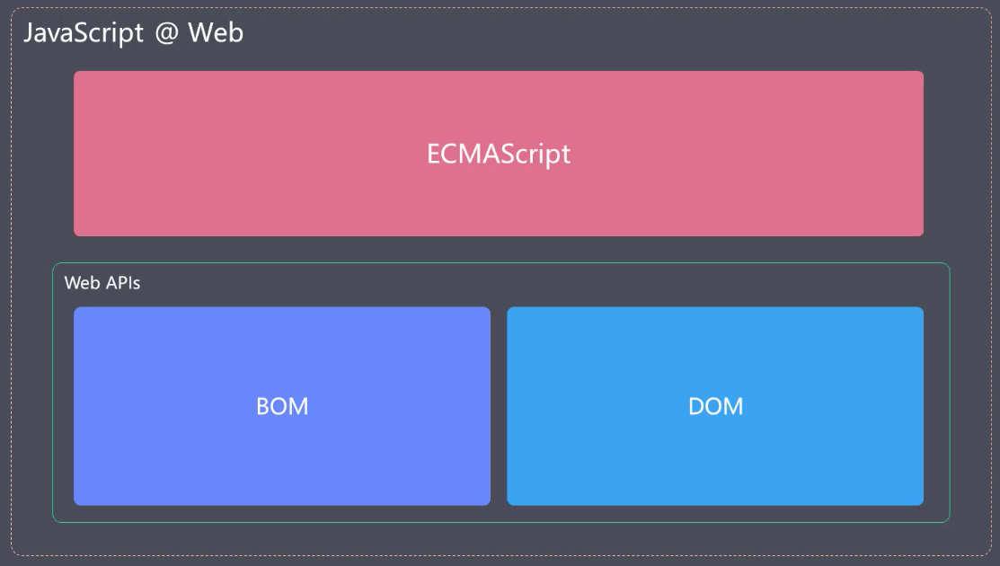
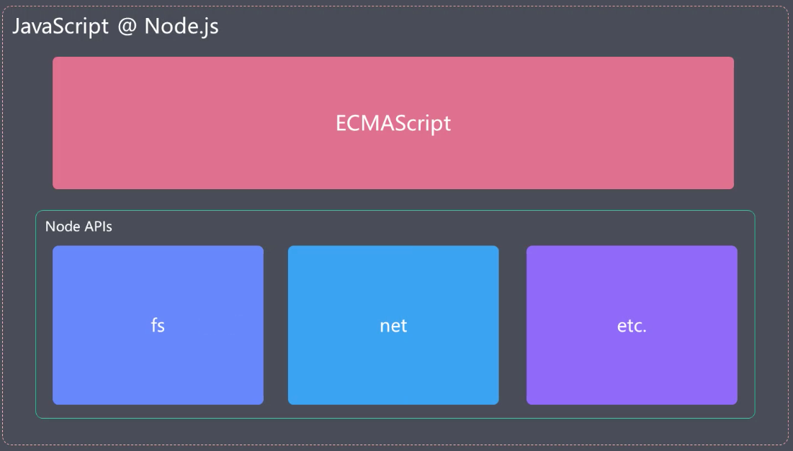

主要梳理一下ES2015的新特性,查缺补漏

<!-- more -->

## ECMAScript和JavaScript
简而言之,ECMAScript是JavaScript的子集,只是规范了语言层面上的一些基础用法,JavaScript则对其进行了扩展。  而在Web和Node中,JavaScript也有所不同,可以使用的能力也有所不同,具体见下图:  

  
  
ES2015是指2015年发布的ECMAScript标准,因为其距离上一版本(2011)发布,间隔时间长,新增特性多,被广大前端er所熟知,也是从这一年起,ECMAScript标准将不再以版本号命名,统一以年份命名。之后的ECMAScript也将会以1年为周期发布新特性。  
  
ES2015主要解决或者说改善的有这几个方面:  
1. 改善原有语法的不足或缺陷
2. 对原有语法进行增强
3. 全新的对象,方法,功能
4. 全新数据类型和数据结构
  
## 块级作用域,let,const
#### ES2015之前的作用域
ES2015之前只有全局作用域和函数作用域。ES2015新增了块级作用域

#### 块
`{...}`双大括号包裹起来的区域
```javascript
if(true){
  var a = 'aaa'
}
if(true){
  let b = 'bbb'
}
console.log(a) //'aaa'
console.log(b) // error
```
var会变量提升至全局作用域,所以console.log可以拿到a。
let声明不会提升,必须要先声明再使用,在块级作用域之外也不可引用,

#### const
相比于let,多了一个只读特性,变量一旦声明就不可以修改了
```javascript
const name //Uncaught SyntaxError: Missing initializer in const declaration
const age = 18
age = 19//Uncaught TypeError: Assignment to constant variable.
```
有一个细节:  
```javascript
const obj = {}
obj.name = 'xiao ming'
console.log(obj) //{name: 'xiao ming'}
obj = {} //Uncaught TypeError: Assignment to constant variable.

const arr = []
arr.push(1) // [1]
arr = [] //Uncaught TypeError: Assignment to constant variable.
```
当声明一个引用类型时,不可更改的是是变量的内存地址,对象内部的值是可以被修改的

#### 最佳实践
不用var,主要使用const,辅助let

## 数组的解构赋值

看代码
```javascript
let [a,b,c] = [1,2,3] //a:1, b:2, c:3

let [a,,c] = [1,2,3] //a:1, c:3

let [a,b,c,d] = [1,2,3] //a:1, b:2, c:3 d:undefined

let [a,[b,c]] = [1,[2,3]] //a:1, b:2, c:3

let [a,...rest] = [1,2,3,4,5] //a:1 ,rest: [2,3,4,5]
let [,...rest] = [1,2,3,4,5] //rest: [2,3,4,5]

//可以设定默认值
let [a,b=3] = [1] //a:1, b:3

let path = '/home/work/promise'
let [,...promise] = path.split('/')
console.log(promise) //['home', 'work', 'promise']


```


