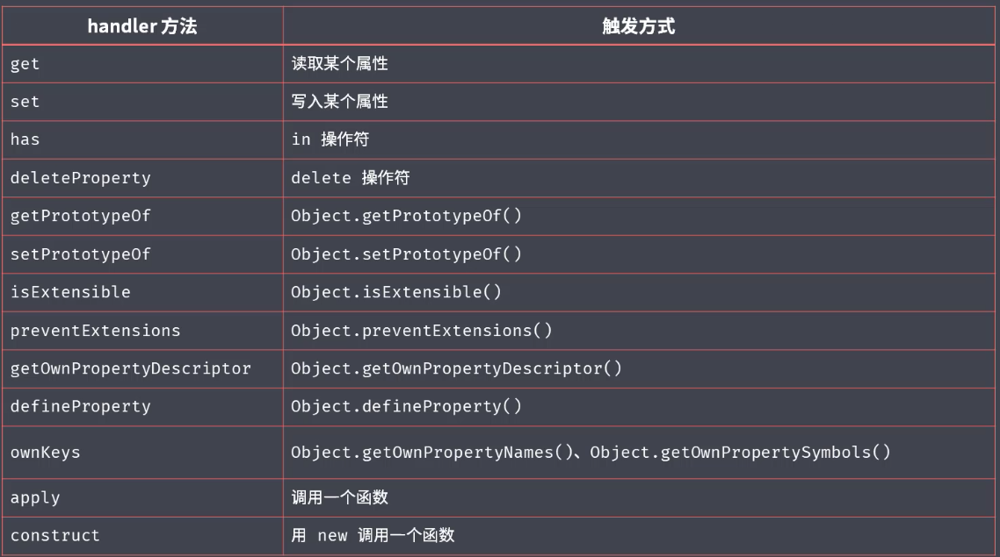

主要梳理一下ES2015的比较常用的新特性,查缺补漏

<!-- more -->

## ECMAScript和JavaScript
简而言之,ECMAScript是JavaScript的子集,只是规范了语言层面上的一些基础用法,JavaScript则对其进行了扩展。  而在Web和Node中,JavaScript也有所不同,可以使用的能力也有所不同,具体见下图:  

  
  
ES2015是指2015年发布的ECMAScript标准,因为其距离上一版本(2011)发布,间隔时间长,新增特性多,被广大前端er所熟知,也是从这一年起,ECMAScript标准将不再以版本号命名,统一以年份命名。之后的ECMAScript也将会以1年为周期发布新特性。  
  
ES2015主要解决或者说改善的有这几个方面:  
1. 改善原有语法的不足或缺陷
2. 对原有语法进行增强
3. 全新的对象,方法,功能
4. 全新数据类型和数据结构
  
## 块级作用域,let,const
#### ES2015之前的作用域
ES2015之前只有全局作用域和函数作用域。ES2015新增了块级作用域

#### 块
`{...}`双大括号包裹起来的区域
```javascript
if(true){
  var a = 'aaa'
}
if(true){
  let b = 'bbb'
}
console.log(a) //'aaa'
console.log(b) // error
```
var会变量提升至全局作用域,所以console.log可以拿到a。
let声明不会提升,必须要先声明再使用,在块级作用域之外也不可引用,

#### const
相比于let,多了一个只读特性,变量一旦声明就不可以修改了
```javascript
const name //Uncaught SyntaxError: Missing initializer in const declaration
const age = 18
age = 19//Uncaught TypeError: Assignment to constant variable.
```
有一个细节:  
```javascript
const obj = {}
obj.name = 'xiao ming'
console.log(obj) //{name: 'xiao ming'}
obj = {} //Uncaught TypeError: Assignment to constant variable.

const arr = []
arr.push(1) // [1]
arr = [] //Uncaught TypeError: Assignment to constant variable.
```
当声明一个引用类型时,不可更改的是是变量的内存地址,对象内部的值是可以被修改的

#### 最佳实践
不用var,主要使用const,辅助let

## 数组的解构赋值

看代码
```javascript
let [a,b,c] = [1,2,3] //a:1, b:2, c:3

let [a,,c] = [1,2,3] //a:1, c:3

let [a,b,c,d] = [1,2,3] //a:1, b:2, c:3 d:undefined

let [a,[b,c]] = [1,[2,3]] //a:1, b:2, c:3

let [a,...rest] = [1,2,3,4,5] //a:1 ,rest: [2,3,4,5]
let [,...rest] = [1,2,3,4,5] //rest: [2,3,4,5]

//可以设定默认值
let [a,b=3] = [1] //a:1, b:3

let path = '/home/work/promise'
let [,...promise] = path.split('/')
console.log(promise) //['home', 'work', 'promise']

```

## 对象的解构赋值
看代码
```javascript
//ES2015以前
let person = {
  name: 'jack',
  age: 18
}

let name = person.name
let age = person.age

//ES2015以后
let person2 = {
  name: 'jack',
  age: 18
}
let {name,age} = person2
console.log(name,age)//'jack' 18

let person3 = {
  name: 'jack',
  age: 18
}
//同样可以设置默认值
let {name,age,gender='women'} = person3
console.log(gender)//'women'

//如果想重新设置属性名
let person4 = {
  name: 'jack',
  age: 18
}
let {name:name2,age} = person4
console.log(name2)// 'jack'
```

## 模板字符串
模板字符串由两个反引号`''`组成
#### 保留格式

#### 变量,表达式,函数
```javascript
let name = 'jack'
let age = 18

let str = `Hi, I am ${name},${age} years old.`
//'Hi, I am jack,18 years old.'
```
`${}`支持内支持js表达式,JS运算等
```javascript
let name = 'jack'
let name2 = 'nancy'
let age = 18
let age2 = 19
let gender = false

let str = `Hi, I am ${gender ? name: name2},${gender ? age : age2} years old.`
//'Hi, I am nancy,19 years old.'
```
模板字符串内也可以使用函数
```javascript
function person() {
  return 'jack'
}
let str = `Hi, I am ${person()},18 years old.`
//'Hi, I am jack,18 years old.'
```

#### 标签模板
模板字符串紧跟在一个函数后面,称之为标签模板(tagged template)
```javascript
let name = 'jack'
let age = 18
function myFn(params,...rest){
  console.log(params)
  console.log(rest)
}
let str = myFn`Hi, I am ${name},${age} years old.`
```
  
标签函数第一个参数是字符串形成的一个数组,包含被`${}`分开的字符串,和不含`${}`的raw数组,如图所示

## 字符串扩展方法
#### includes(),startWith(),endWith()
这三个比较常用
```javascript
let str = 'Hi, I am jack,18 years old.'
str.includes('18') // true
str.startsWith('am') // false
str.endsWith('old') //true
```
需要注意的是,这三个方法都对大小写,空格敏感

## 函数参数默认值,剩余参数
#### 参数默认值
```javascript
function fn(data,obj = {}){
  console.log(obj,data)
}
fn(1) //1,{}
```
需要注意的是,带有默认值的参数必须放在最后一位,不然默认值不会正常工作
```javascript
function fn(data,obj = {},age){
  console.log(obj,data,age)
}
fn(1,18) // 18 1 undefined
```
#### 剩余参数

当定义函数时,如果函数参数的个数不确定时,可以使用剩余参数来表示
```javascript
function fn(data,...rest){
  console.log(data)
  console.log(rest)
}
fn('data',2,3,4,5,6) 
//data
//[2,3,4,5,6]
```

## 箭头函数
箭头函数可以简化我们声明函数的代码量,提高代码可阅读性
```javascript
function fn (){
  console.log(123)
}
let fn = () => console.log(123)
```
箭头函数的`return`可以隐藏
```javascript
let fn = v => v
//等同于
function fn(v){
  return v
}
```
箭头函数会改变this的指向
```javascript
let person = {
  name: 'jack',
  sayHi: function(){
    console.log(this.name,'name')
  }
}
person.sayHi()// 'jack' 'name'
```
这时的`this`就会指向调用它的`person`  
如果我们把它改成箭头函数
```javascript
let person = {
  name: 'jack',
  sayHi: () => {
    console.log(this.name,'name')
  }
}
person.sayHi()// undefined 'name'
```
箭头函数不可以当做构造函数,也就是不能new一个箭头函数

## 对象的部分增强
#### 字面量增强
```javascript
//ES2015以前
let foo = 'hello'
let obj = {
  name: 'jack',
  foo: foo,
  hello: function(){console.log('hello')}
}
obj[Math.random()] = 'random'

//ES2015后
let foo = 'hello'
let obj = {
  name: 'jack',
  foo,
  hello(){console.log('hello')},
  [Math.random()]: 'random'
}
```
#### 新增方法 Object.assign
将source对象属性合并至target对象
```javascript
let obj = {
  a:3,
  b:4
}
let newObj = Object.assign(obj,{b:7,c:5})
console.log(newObj)//{a:3,b:7,c:5}
```
#### Object.assign注意点
1. 浅拷贝,返回的新对象是target对象的浅拷贝,共享一个内存地址
2. source对象如果含有target对象一样的属性值,合并后会覆盖target上的属性值
3. 对于嵌套的结构,合并是替换的效果,而不是添加
```javascript
let target = {
  a: 1,
  b: {
    c: 2,
    d: 3
  }
}
let source = {
  a:1, 
  b: {
    c: 3
  }
}
let newObj = Object.assign(target,source)
console.log(newObj)  // {a:1,b: {c: 3}}
```
4. source对象是undefined,null,Boolean,NaN,Number时,合并完还是返回原来的对象
```javascript
let target = {
    a: 1
}
let newObj = Object.assign(target,undefined,null,NaN,10,true)
console.log(newObj)//{a: 1}
```
5. 如果source对象的get有一个返回值的一个函数, 会先将值计算出来再合并
```javascript
let target = {}
let source = {get a(){return 1}}
let newObj = Object.assign(target,source)
console.log(newObj)// {a: 1}
```

#### Object.assign的一些用法
1. 将属性、方法添加到对象上
2. 为函数的参数提供默认值
```javascript
let defaultOpts ={
  open: true,
  status: 1
} 
let fn = (options) => {
  options = Object.assign({},defaultOpts,options)
  console.log(options)
}
```
3. 合并对象,克隆对象

#### Object.is
在`===`的基础上,`Object.is`可以判断NaN
```javascript
let target = NaN
console.log(target === NaN)
Object.is(target,NaN)
```

## Proxy
Proxy可以理解为在Object上面多加了一层过滤器/拦截器, 能够对对象的读写等等的操作进行拦截并改写。

```javascript
target = {
  name: 'jack',
  age: 18
}
let proxyObj = new Proxy(target,{
  get: function(a,b){
    console.log(a, 'get a')
    console.log(b, 'get b')
  },
  set: function(a,b,c){
    console.log(a, 'set a')
    console.log(b, 'set b')
    console.log(c, 'set c')
  }
})
console.log(proxyObj.name)
// { name: 'jack', age: 18 } get a
// name get b
proxyObj.name = 'frank'
// { name: 'jack', age: 18 } set a
// name set b
// frank set c

```
#### Proxy与Object.defineProperty的区别
1. Object.defineProperty只能对对象的读写操作进行拦截。  
Proxy则可以对除了读写之外,更多的对象上的操作进行拦截。

下面是 Proxy 支持的拦截操作一览，一共 13 种。



2. Proxy可以更好地代理数组的操作
vue2.0中,为了实现数据响应式,对数组的操作数据方法进行了重写。
而如果使用Proxy则可以轻松地达到这一目的。
```javascript
let list = []

let proxyList = new Proxy(list,{
  set(target,property,value){
    console.log(property,'property')
    console.log(value,'value')
    target[property] = value
    return true
  }
})
proxyList.push(1)
// 0 property
// 1 value
// length property
// 1 value
```
3. Object.defineProperty的使用上比Proxy更'侵入式'
Object.defineProperty需要对每个对象的属性的读写操作都进行改写
```javascript
let person = {
  name: 'jack',
  age: 18
}
Object.defineProperties(person,'name',{
  get(){/*todoSomething*/},
  set(){/*todoSomething*/},
})
//Proxy
let proxyList = new Proxy(person,{
  get(target,property,value){},
  set(target,property,value){}
})
```

## Reflect
Reflect拥有和Proxy一样的13个方法。这样的好处是,无论Proxy怎么修改原对象的默认行为,都可以用Reflect来完成默认行为,例如:  
```javascript
Proxy(target, {
  set: function (target,property,value, handler){
    console.log('Proxy behavior')
    return Reflect.set(target,property,value,handler)
  }
})
```
挂载在对象上的方法在Reflect上都能找到。例如:  
```javascript
//old
Object.defineProperty(target, property, attributes)
//new
Reflect.defineProperty(target, property, attributes)
```
操作对象的一些命令式语句,在Reflect上都用函数式的方式实现了。例如:  
```javascript
//old
'assign' in Object // true
//new
Reflect.has(Object, 'assign') // true
```
修改了有些Object方法的返回结果(具体在Reflect源码上看,篇幅原因这里不列举了),例如:  
```javascript
Object.defineProperty(target, property, attributes) //失败会报错
//new
Reflect.defineProperty(target, property, attributes) // 成功返回true,失败返回false

```

## Promise
见[手写Promise](https://kkanll.wang/posts/2022-05-14-myPromise.html)
## class 类
### 基本用法
ES2015提供了和Java语言类似的类的实现方式。
```javascript
class Person {
  constructor(name,age){
    //构造函数,参数为new 一个实例对象所传过来的参数
    //this指向这个类的实例
    this.name = name
    this.age = age
  }
  
  xxx(){
    //类的方法
    console.log('person function')
  }
}

//使用
let jack = new Person('jack',22)
```
### get和set
class类上有get和set函数,对值的读取和设置进行拦截
```javascript
class Person {
  constructor() {
    // ...
  }
  get weight() {
    return 'getter';
  }
  set weight(value) {
    console.log('setter: '+value);
  }
}

let human = new Person();
console.log(human.weight)
// 'getter'
human.weigth = 123;
// setter: 123
```
### 静态方法
class上的静态不能被实例继承, 只能通过类来直接调用
```javascript
class Person {
  constructor() {
    // ...
  }
  static eat(){
    console.log('eating')
  }
}
Person.eat() // 'eating'
```
但父类的静态方法会被子类继承
```javascript
class Person {
  constructor() {
    // ...
  }
  static eat(){
    console.log('eating')
  }
}
class Japanese extends Person { }
Japanese.eat() // 'eating'
```
:::warning 
静态方法中的this指向的是class
:::
```javascript
class Person {
  constructor() {
    // ...
  }
  static eat(){
    this.xxx()
  }
  static xxx(){
    console.log('xxx')
  }
  xxx(){
    console.log('instance xxx')
  }
}
Person.eat() // 'xxx'
```
### 继承
使用`extends`关键字继承,注意子类在`constructor`中必须调用`super()`
:::warning
`super()`之前不能使用this
:::

```javascript
class Person {
  constructor(name,age) {
    // ...
  }
}
class Japanese extends Person {
  constructor(name,age,gender) {
    this.gender = gender //error
    super(name,age,gender);
    this.name = name
    this.age = age
  }
}
```

除了在constructor()中使用,super还能作为对象使用,指向父类的原型
:::warning
super调用父类方法时,this指向子类实例
:::
```javascript
class Person {
  constructor() {
    // ...
  }
  eat(){
    console.log(this)
    return 'eating'
  }
}
class Japanese extends Person {
  constructor() {
    super();
    console.log(super.eat())
  }
}
let j = new Japanese() 
// j 实例
// eating
```
## Set
## Map
## Symbol
## for..of
## 可迭代接口
## 迭代器模式
## 生成器
## ES Modules


