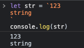
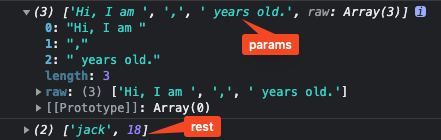

主要梳理一下ES2015的比较常用的新特性,查缺补漏

<!-- more -->

## ECMAScript和JavaScript
简而言之,ECMAScript是JavaScript的子集,只是规范了语言层面上的一些基础用法,JavaScript则对其进行了扩展。  而在Web和Node中,JavaScript也有所不同,可以使用的能力也有所不同,具体见下图:  

  
  
ES2015是指2015年发布的ECMAScript标准,因为其距离上一版本(2011)发布,间隔时间长,新增特性多,被广大前端er所熟知,也是从这一年起,ECMAScript标准将不再以版本号命名,统一以年份命名。之后的ECMAScript也将会以1年为周期发布新特性。  
  
ES2015主要解决或者说改善的有这几个方面:  
1. 改善原有语法的不足或缺陷
2. 对原有语法进行增强
3. 全新的对象,方法,功能
4. 全新数据类型和数据结构
  
## 块级作用域,let,const
#### ES2015之前的作用域
ES2015之前只有全局作用域和函数作用域。ES2015新增了块级作用域

#### 块
`{...}`双大括号包裹起来的区域
```javascript
if(true){
  var a = 'aaa'
}
if(true){
  let b = 'bbb'
}
console.log(a) //'aaa'
console.log(b) // error
```
var会变量提升至全局作用域,所以console.log可以拿到a。
let声明不会提升,必须要先声明再使用,在块级作用域之外也不可引用,

#### const
相比于let,多了一个只读特性,变量一旦声明就不可以修改了
```javascript
const name //Uncaught SyntaxError: Missing initializer in const declaration
const age = 18
age = 19//Uncaught TypeError: Assignment to constant variable.
```
有一个细节:  
```javascript
const obj = {}
obj.name = 'xiao ming'
console.log(obj) //{name: 'xiao ming'}
obj = {} //Uncaught TypeError: Assignment to constant variable.

const arr = []
arr.push(1) // [1]
arr = [] //Uncaught TypeError: Assignment to constant variable.
```
当声明一个引用类型时,不可更改的是是变量的内存地址,对象内部的值是可以被修改的

#### 最佳实践
不用var,主要使用const,辅助let

## 数组的解构赋值

看代码
```javascript
let [a,b,c] = [1,2,3] //a:1, b:2, c:3

let [a,,c] = [1,2,3] //a:1, c:3

let [a,b,c,d] = [1,2,3] //a:1, b:2, c:3 d:undefined

let [a,[b,c]] = [1,[2,3]] //a:1, b:2, c:3

let [a,...rest] = [1,2,3,4,5] //a:1 ,rest: [2,3,4,5]
let [,...rest] = [1,2,3,4,5] //rest: [2,3,4,5]

//可以设定默认值
let [a,b=3] = [1] //a:1, b:3

let path = '/home/work/promise'
let [,...promise] = path.split('/')
console.log(promise) //['home', 'work', 'promise']

```

## 对象的解构赋值
看代码
```javascript
//ES2015以前
let person = {
  name: 'jack',
  age: 18
}

let name = person.name
let age = person.age

//ES2015以后
let person2 = {
  name: 'jack',
  age: 18
}
let {name,age} = person2
console.log(name,age)//'jack' 18

let person3 = {
  name: 'jack',
  age: 18
}
//同样可以设置默认值
let {name,age,gender='women'} = person3
console.log(gender)//'women'

//如果想重新设置属性名
let person4 = {
  name: 'jack',
  age: 18
}
let {name:name2,age} = person4
console.log(name2)// 'jack'
```

## 模板字符串
模板字符串由两个反引号`''`组成
#### 保留格式

#### 变量,表达式,函数
```javascript
let name = 'jack'
let age = 18

let str = `Hi, I am ${name},${age} years old.`
//'Hi, I am jack,18 years old.'
```
`${}`支持内支持js表达式,JS运算等
```javascript
let name = 'jack'
let name2 = 'nancy'
let age = 18
let age2 = 19
let gender = false

let str = `Hi, I am ${gender ? name: name2},${gender ? age : age2} years old.`
//'Hi, I am nancy,19 years old.'
```
模板字符串内也可以使用函数
```javascript
function person() {
  return 'jack'
}
let str = `Hi, I am ${person()},18 years old.`
//'Hi, I am jack,18 years old.'
```

#### 标签模板
模板字符串紧跟在一个函数后面,称之为标签模板(tagged template)
```javascript
let name = 'jack'
let age = 18
function myFn(params,...rest){
  console.log(params)
  console.log(rest)
}
let str = myFn`Hi, I am ${name},${age} years old.`
```
  
标签函数第一个参数是字符串形成的一个数组,包含被`${}`分开的字符串,和不含`${}`的raw数组,如图所示

## 字符串扩展方法
#### includes(),startWith(),endWith()
这三个比较常用
```javascript
let str = 'Hi, I am jack,18 years old.'
str.includes('18') // true
str.startsWith('am') // false
str.endsWith('old') //true
```
需要注意的是,这三个方法都对大小写,空格敏感

## 函数参数默认值,剩余参数
#### 参数默认值
```javascript
function fn(data,obj = {}){
  console.log(obj,data)
}
fn(1) //1,{}
```
需要注意的是,带有默认值的参数必须放在最后一位,不然默认值不会正常工作
```javascript
function fn(data,obj = {},age){
  console.log(obj,data,age)
}
fn(1,18) // 18 1 undefined
```
#### 剩余参数

当定义函数时,如果函数参数的个数不确定时,可以使用剩余参数来表示
```javascript
function fn(data,...rest){
  console.log(data)
  console.log(rest)
}
fn('data',2,3,4,5,6) 
//data
//[2,3,4,5,6]
```

## 箭头函数
箭头函数可以简化我们声明函数的代码量,提高代码可阅读性
```javascript
function fn (){
  console.log(123)
}
let fn = () => console.log(123)
```
箭头函数的`return`可以隐藏
```javascript
let fn = v => v
//等同于
function fn(v){
  return v
}
```
箭头函数会改变this的指向
```javascript
let person = {
  name: 'jack',
  sayHi: function(){
    console.log(this.name,'name')
  }
}
person.sayHi()// 'jack' 'name'
```
这时的`this`就会指向调用它的`person`  
如果我们把它改成箭头函数
```javascript
let person = {
  name: 'jack',
  sayHi: () => {
    console.log(this.name,'name')
  }
}
person.sayHi()// undefined 'name'
```

## 对象的部分增强
#### 字面量增强
```javascript
//ES2015以前
let foo = 'hello'
let obj = {
  name: 'jack',
  foo: foo,
  hello: function(){console.log('hello')}
}
obj[Math.random()] = 'random'

//ES2015后
let foo = 'hello'
let obj = {
  name: 'jack',
  foo,
  hello(){console.log('hello')},
  [Math.random()]: 'random'
}
```
#### 新增方法 Object.assign


