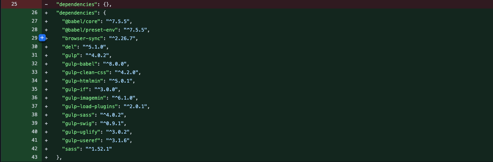

## gulp任务
执行命令: `gulp taskName`
在gulp4.0.0之前使用的是`task()`这个api来创建任务,现在官方已经推荐使用`exports`的方式来注册任务。  


```javascript
//gulpfile.js
const gulp = require('gulp')

gulp.task('bar', done => {
  console.log('bar working')
  done()
})
```
exports方式来注册任务  
其中`default`可以直接通过gulp而不需要加上任务名就可以执行
```javascript
//gulpfile.js
exports.foo = done => {
  console.log('foo working')
  done()
}
exports.default = done => {
  console.log('default')
  done()
}
```

### 串行任务
串行任务,和字面意思一样,会按照顺序依次执行
```javascript
//gulpfile.js
const { series } = require('gulp')

const task1 = done => {
  setTimeout(()=> {
    console.log('series task')
  },3000)
}
const task2 = done => {
  setTimeout(()=> {
    console.log('series task')
  },3000)
}

exports.foo = series(task1,task2)

```
### 并行任务
并行任务, 并行执行所注册的任务
```javascript
//gulpfile.js
const { parallel } = require('gulp')

exports.bar = parallel(task1,task2)

```

### 异步任务
gulp中也支持Promise和async/await
```javascript
//gulpfile.js
exports.promise = () => {
  console.log('promise')
  return Promise.resolve()
}

exports.promise_reject = () => {
  console.log('promise reject')
  return Promise.reject(new Error('task failed'))
}
```
::: warning
需要注意的是,gulp里面,Promise.resolve()的参数会被忽略,也就是无法传递到then中
:::

async/await也是正常生效的。
```javascript
const timeout = time => {
  return new Promise(resolve => {
    setTimeout(resolve, time)
  })
}

exports.async = async () => {
  await timeout(1000)
  console.log('async task')
}
```

构建/打包工具肯定离不开文件的读写,在gulp中steam任务也是经常用到的  
这里 `fs.createReadStream`读取文件,`fs.createWriteStream`写入文件  
再使用`pipe`倾倒文件内容至write中
```javascript
exports.stream = () => {
  const read = fs.createReadStream('gulpfile.js')
  const write = fs.createWriteStream('xxx.txt')
  read.pipe(write)
  return read
}
```

## Gulp构建核心原理(The streaming building system)
总的概括来说分三步走:
1. 读取流
2. 处理流
3. 写入流

```javascript
const { Transform } = require('stream')
const fs = require('fs')

exports.cssTransform = done => {
  //读取文件
  const read = fs.createReadStream('test.css')
  //写入文件
  const write = fs.createWriteStream('testMini.css')
  //转换文件
  const transfrom = new Transform({
    transform(chunk, encode, callback) {
      const input = chunk.toString()
      const output = input.replace(/\s+/g, '').replace(/\/\*.+?\*\//g, '')
      callback(null,output)
    }
  })
  
  read
    .pipe(transfrom)
    .pipe(write)
  
  return read
}
```


## 实现一个自动构建工作流-配置gulpfile.js
```javascript
const { src, dest, parallel, series, watch } = require('gulp')

const del = require('del')
const browserSync = require('browser-sync')

// 这里统一使用gulp-load-plugins管理插件
// 使用方式改为plugins.xxx
/*------------原来的插件调用方式-------------------------*/
// const sass = require('gulp-sass')(require('sass'))
// const babel = require('gulp-babel')
// const swig = require('gulp-swig')
// const imagemin = require('gulp-imagemin')
/*------------End-------------------------------------*/
const loadPlugins = require('gulp-load-plugins')
const plugins = loadPlugins()

const bs = browserSync.create()

const data = {
  menus: [
    {
      name: 'Home',
      icon: 'aperture',
      link: 'index.html'
    },
    {
      name: 'Features',
      link: 'features.html'
    },
    {
      name: 'About',
      link: 'about.html'
    },
    {
      name: 'Contact',
      link: '#',
      children: [
        {
          name: 'Twitter',
          link: 'https://twitter.com/w_zce'
        },
        {
          name: 'About',
          link: 'https://weibo.com/zceme'
        },
        {
          name: 'divider'
        },
        {
          name: 'About',
          link: 'https://github.com/zce'
        }
      ]
    }
  ],
  pkg: require('./package.json'),
  date: new Date()
}

// 使用del在构建前先清除dist, temp文件夹
const clean = () => {
  return del(['dist', 'temp'])
}

// 样式处理流程
const style = () => {
  // base选项保留项目原始的目录结构,比如src/assets/styles,构建完也会是这个目录结构
  // cwd选项会自动从src开始, 然后结合config.build.paths.styles路径,结果也是'src/assets/styles/*.scss'
  return src('src/assets/styles/*.scss', { base: 'src' })
    // css代码{}完全展开
    .pipe(plugins.sass({ outputStyle: 'expanded' }))
    .pipe(dest('temp'))
    .pipe(bs.reload({ stream: true }))
}

// js文件处理
const script = () => {
  return src('src/assets/scripts/*.js', { base: 'src' })
    // babel preset 预设
    .pipe(plugins.babel({ presets: ['@babel/preset-env'] }))
    .pipe(dest('temp'))
    .pipe(bs.reload({ stream: true }))
}

//html处理
const page = () => {
  // 如果src目录下有多个html需要编译的话,地址可以写成'src/**/*.html'表示src下任意的html文件,下同
  return src('src/*.html', { base: 'src' })
    // 向html文件中传入data
    .pipe(plugins.swig({ data, defaults: { cache: false } })) // 防止模板缓存导致页面不能及时更新
    .pipe(dest('temp'))
    .pipe(bs.reload({ stream: true }))
}

// 图片处理
const image = () => {
  return src('src/assets/images/**', { base: 'src' })
    .pipe(plugins.imagemin())
    .pipe(dest('dist'))
}

// 字体处理
const font = () => {
  return src('src/assets/fonts/**', { base: 'src' })
    .pipe(plugins.imagemin())
    .pipe(dest('dist'))
}

// 处理public中的文件,原封不动放到public
const extra = () => {
  return src('public/**', { base: 'public' })
    .pipe(dest('dist'))
}

// 开发服务器配置
const serve = () => {
  // 使用gulp的watch来监视src下源码的变化, 重新执行对应的任务
  // 这里cwd的作用也是默认从src开始,结果是'src/assets/styles/*.scss'这种
  watch('src/assets/styles/*.scss', style)
  watch('src/assets/scripts/*.js', script)
  watch('src/*.html', page)
  // 响应public/assets里的文件发生的变化
  watch([
    'src/assets/images/**',
    'src/assets/fonts/**',
    'public/**'
  ], bs.reload)
  
  bs.init({
    notify: false,
    port: 2080, // 端口
    // open: false,
    
    // 可以监听指定目录的变化,自动更新展示效果,如果任务中配置了pipe(bs.reload({ stream: true }))就不需要了
    // files: 'dist/**',
    server: {
      // 根目录,这里数组的原因是: 启动服务器后会依次寻找数组中的文件夹,如果找不到相应文件就会继续往下寻找
      // 我们开发环境下不需要每次更新都对public/assets文件夹里的文件进行上面的处理任务
      // 让develop能以最小的代价来执行
      baseDir: ['temp', 'src', 'public'],
      // index.html文件中需要特殊处理的路径
      routes: {
        '/node_modules': 'node_modules'
      }
    }
  })
}

const useref = () => {
  return src('temp/*.html', { base: 'temp' })
    // html中有些是需要引入第三方库,比如:"/node_modules/bootstrap/xxx/xxxx"
    // 这些文件发布到线上后,在服务器中肯定是找不到的,开发环境之所以运行没问题是因为我们在server选项中配置了routes属性来映射这个路径
    // 处理方法是: 在html中需要引入的资源那行html代码前后用注释来进行标记,之后useref会自动处理这部分内容,如下
    
    /*
      * <!-- build:css assets/styles/vender.css-->
      * <link rel="stylesheet" href="/node_modules/bootstrap/dist/css/bootstrap.css">
      * <!-- endbuild -->
      * */
    
    // 最终,这个第三方依赖文件会被打包到标记注释所设置的assets/styles/vender.css中
    // 并且,如果指定的文件名是一样的话(比如都是vender.css)代码就会合并到一个文件中并压缩
    /* ----------------------------------------------------------------------------------- */
    // searchPath用来指定在哪些路径下寻找文件,比如/node_module就在'.'项目根目录下寻找
    .pipe(plugins.useref({ searchPath: ['temp', '.'] }))
    // 使用gulp-if插件来判断html js css,并执行相应的transform
    .pipe(plugins.if(/\.js$/, plugins.uglify()))
    .pipe(plugins.if(/\.css$/, plugins.cleanCss()))
    .pipe(plugins.if(/\.html$/, plugins.htmlmin({
      collapseWhitespace: true, // html压缩,换行,空格等
      minifyCSS: true, // 压缩行内style
      minifyJS: true // 压缩行内js
    })))
    .pipe(dest('dist'))
}

// 并行处理
const compile = parallel(style, script, page)

// 上线之前执行的任务 串行套并行,再套并行
const build =  series(
  clean,
  parallel(
    series(compile, useref),
    image,
    font,
    extra
  )
)

// 开发环境下的任务
const develop = series(compile, serve)

module.exports = {
  clean,
  build,
  develop
}

```
## 复用gulpfile.js
虽然可以通过复制gulpfile.js来实现在各个不同的项目中复用这个构建过程,但一来'复制/粘贴'这个动作本身也是重复的,二来,如果对构建文件有修改,这时候几十个项目都用到了这个gulpfile文件,那我们就得修改几十次,显示这是一个效率很低的方式。

我们可以通过将gulpfile和gulp-cli结合, 生成一个npm依赖。使用时,在项目中安装这个依赖,设置这个依赖所提供的配置项,通过一条命令就能完成我们的构建过程。需要修改构建流程时,就在这个依赖中统一修改,避免了修改N次这样的重复劳动。

#### 一些准备工作
1. 新建github仓库,存放我们要创建的cli包--xx-pages
2. 初始化这个仓库,基本结构如下
```
└── xx-pages ································· project root
   ├─ lib ········································· lib folder
   │  └─ index.js ································· entry file
   ├─ .gitignore ····································· git ignore file
   ├─ README.md ······································ repo readme
   └─ package.json ······································ package file
```

#### 提取gulpfile.js
1. 复制gulpfile文件中的内容至index.js
2. 将我们配置gulpfile.js时用到的开发依赖移动至xx-pages这个项目中,也就是`package.json`中的`dependencies`中。放在dependencies下,安装xx-pages时就会自动下载dependencies中的依赖  
   
3. 移除项目中`package.json`的开发依赖(devDependencies)
4. 删除项目中gulpfile.js中的内容
5. 因为我们还需要本地调试后再发布xx-pages,先通过几个步骤来本地使用xx-pages
6. 在xx-pages目录下, `yarn link` 或者 `npm link`,将xx-pages链接到全局
7. 项目中通过 `yarn link "xx-pages"`链接到xx-pages,我们就可以在项目中使用xx-pages了
8. 修改项目中的gulpfile.js,
```javascript
module.exports = require('xx-pages')
```
运行xx-pages等同于导出了我们之前写的gulpfile的构建代码,这里修改后,运行gulp命令就等同于运行gulp构建代码
9. 但这时运行`yarn gulp build`或者`npm run gulp build`后会报错, 是因为我们现在还是依赖于gulp-cli的指令来运行我们的构建代码,所以为了调试,这里我们先临时安装一下gulp-cli和gulp

```shell
$ yarn add gulp-cli gulp --dev
#or
$ npm i gulp-cli gulp -D
```
10. 现在我们运行`gulp build`,会报一个`Cannot find module './package.json'`的错误,原因是我们在构建代码中require了package.json文件(可以回头翻一下代码),作为一个公共的包,这些定制化的数据/代码,我们需要抽离出来,放在我们自定义的一个`pages.config.js`中(名字无所谓)
```javascript
//pages.config.js
module.exports = {
  data:  {
    menus: [],//篇幅原因,省略数组中的具体内容
    pkg: require('./package.json'),
    date: new Date()
  }
}
```
11. 修改`xx-pages/lib/index.js`, 支持默认配置项,并且能合并项目中的`pages.config.js`文件
```javascript
//xx-pages/lib/index.js
/*-----省略-----*/
const cwd = process.cwd()
let config = {
  // default options
}
try {
  const loadConfig = require(path.join(cwd, 'pages.config.js'))
  config = Object.assign({}, config, loadConfig)
} catch (e) { }
/*-----省略-----*/
```
12. 再次运行, 这时会报一个`Cannot find module '@babel/preset-env'`的错误,原因是我们在处理js文件时,使用了@babel/preset-env
```javascript
/*-----省略-----*/
// js文件处理
const script = () => {
  return src(config.build.paths.scripts, { base: config.build.src, cwd: config.build.src })
    // babel preset 预设
    .pipe(plugins.babel({ presets: [require('@babel/preset-env')] }))
    .pipe(dest(config.build.temp))
    .pipe(bs.reload({ stream: true }))
}
/*-----省略-----*/
```
13. 针对构建代码中的路径,提取成可配置选项
```javascript
// 实现这个项目的构建任务
const { src, dest, parallel, series, watch } = require('gulp')
const path = require('path')

const del = require('del')
const browserSync = require('browser-sync')

// 这里统一使用gulp-load-plugins管理插件
// 使用方式改为plugins.xxx

// const sass = require('gulp-sass')(require('sass'))
// const babel = require('gulp-babel')
// const swig = require('gulp-swig')
// const imagemin = require('gulp-imagemin')
const loadPlugins = require('gulp-load-plugins')
const plugins = loadPlugins()

const bs = browserSync.create()

const cwd = process.cwd()
let config = {
  // default options
  build: {
    src: 'src',
    dist: 'dist',
    temp: 'temp',
    public: 'public',
    paths: {
      styles: 'assets/styles/*.scss',
      scripts: 'assets/scripts/*.js',
      pages: '*.html',
      images: 'assets/images/**',
      fonts: 'assets/fonts/**'
    }
  }
}
try {
  //读取自定义配置pages.config.js文件
  const loadConfig = require(path.join(cwd, 'pages.config.js'))
  //合并默认配置
  config = Object.assign({}, config, loadConfig)
} catch (e) { }

// 使用del在构建前先清除dist, temp文件夹
const clean = () => {
  return del([config.build.dist, config.build.temp])
}

// 样式处理流程
const style = () => {
  // base会指定该文件也就是index.js的位置,可以说是变化的,如果你发布成了npm包,那路径就会变成node_modules/wk-pages-try
  // cwd会指定到你在终端执行命令的路径, 然后结合config.build.paths.styles路径,结果也是'src/assets/styles/*.scss'
  return src(config.build.paths.styles, { base: config.build.src, cwd: config.build.src })
    // css代码{}完全展开
    .pipe(plugins.sass({ outputStyle: 'expanded' }))
    .pipe(dest(config.build.temp))
    .pipe(bs.reload({ stream: true }))
}

// js文件处理
const script = () => {
  return src(config.build.paths.scripts, { base: config.build.src, cwd: config.build.src })
    // babel preset 预设
    .pipe(plugins.babel({ presets: [require('@babel/preset-env')] }))
    .pipe(dest(config.build.temp))
    .pipe(bs.reload({ stream: true }))
}

const page = () => {
  // 如果src目录下有多个html需要编译的话,地址可以写成'src/**/*.html'表示src下任意的html文件,下同
  return src(config.build.paths.pages, { base: config.build.src, cwd: config.build.src })
    // 向html文件中传入data
    .pipe(plugins.swig({ data: config.data, defaults: { cache: false } })) // cache选项防止模板缓存导致页面不能及时更新
    .pipe(dest(config.build.temp))
    .pipe(bs.reload({ stream: true }))
}

// 图片处理
const image = () => {
  return src(config.build.paths.images, { base: config.build.src, cwd: config.build.src })
    .pipe(plugins.imagemin())
    .pipe(dest(config.build.dist))
}

// 字体处理
const font = () => {
  return src(config.build.paths.fonts, { base: config.build.src, cwd: config.build.src })
    .pipe(plugins.imagemin())
    .pipe(dest(config.build.dist))
}

// 处理public中的文件,原封不动放到public
const extra = () => {
  return src('**', { base: config.build.public, cwd: config.build.public })
    .pipe(dest(config.build.dist))
}

// 开发服务器配置
const serve = () => {
  // 使用gulp的watch来监视src下源码的变化, 重新执行对应的任务
  // 这里cwd的作用也是默认从src开始,结果是'src/assets/styles/*.scss'这种
  watch(config.build.paths.styles, { cwd: config.build.src }, style)
  watch(config.build.paths.scripts, { cwd: config.build.src }, script)
  watch(config.build.paths.pages, { cwd: config.build.src }, page)
  
  // 响应public/assets里的文件发生的变化
  watch([
    config.build.paths.images,
    config.build.paths.fonts
  ], { cwd: config.build.src }, bs.reload)
  
  watch(['**'], { cwd: config.build.public }, bs.reload)
  
  bs.init({
    // 关闭bs的一些提示
    notify: false,
    port: 2080, // 端口
    // open: false, //自动打开窗口,看自己需求,
    
    // 可以监听指定目录的变化,自动更新展示效果,如果任务中配置了pipe(bs.reload({ stream: true }))就不需要了
    // files: 'dist/**',
    server: {
      // 根目录,这里数组的原因是: 启动服务器后会依次寻找数组中的文件夹,如果找不到相应文件就会继续往下寻找
      // 我们开发环境下不需要每次更新都对public/assets文件夹里的文件进行上面的处理任务
      // 让develop能以最小的代价来执行
      baseDir: [config.build.temp, config.build.src, config.build.public],
      // index.html文件中需要特殊处理的路径
      routes: {
        '/node_modules': 'node_modules'
      }
    }
  })
}

const useref = () => {
  return src(config.build.paths.pages, { base: config.build.temp, cwd: config.build.temp })
    // html中有些是需要引入第三方库,比如:"/node_modules/bootstrap/xxx/xxxx"
    // 这些文件发布到线上后,在服务器中肯定是找不到的,开发环境之所以运行没问题是因为我们在server选项中配置了routes属性来映射这个路径
    // 处理方法是: 在html中需要引入的资源那行html代码前后用注释来进行标记,之后useref会自动处理这部分内容,如下
    
    /*
      * <!-- build:css assets/styles/vender.css-->
      * <link rel="stylesheet" href="/node_modules/bootstrap/dist/css/bootstrap.css">
      * <!-- endbuild -->
      * */
    
    // 最终,这个第三方依赖文件会被打包到标记注释所设置的assets/styles/vender.css中
    // 并且,如果指定的文件名是一样的话(比如都是vender.css)代码就会合并到一个文件中并压缩
    /* ----------------------------------------------------------------------------------- */
    // searchPath用来指定在哪些路径下寻找文件,比如/node_module就在'.'项目根目录下寻找
    .pipe(plugins.useref({ searchPath: [config.build.temp, '.'] }))
    // 使用gulp-if插件来判断html js css,并执行相应的transform
    .pipe(plugins.if(/\.js$/, plugins.uglify()))
    .pipe(plugins.if(/\.css$/, plugins.cleanCss()))
    .pipe(plugins.if(/\.html$/, plugins.htmlmin({
      collapseWhitespace: true, // html压缩,换行,空格等
      minifyCSS: true, // 压缩行内style
      minifyJS: true // 压缩行内js
    })))
    .pipe(dest(config.build.dist))
}

// 并行处理
const compile = parallel(style, script, page)

// 上线之前执行的任务 串行套并行,再套并行
const build = series(
  clean,
  parallel(
    series(compile, useref),
    image,
    font,
    extra
  )
)
// 开发环境下的任务
const develop = series(compile, serve)

module.exports = {
  clean,
  build,
  develop,
}

```

## 包装gulp
1. 在xx-pages中,通过bin目录和gulp提供的命令行参数`--cwd` `--gulpfile`包装gulp build命令到xx-pages
```json
{
  "bin": "bin/wk-pages.js",
}
```
```javascript
#!/usr/bin/env node          //必须

process.argv.push('--cwd')
process.argv.push(process.cwd())
process.argv.push('--gulpfile')
process.argv.push(require.resolve('..'))

require('gulp/bin/gulp')
```
2. 重新链接xx-pages,只有这样,我们设置的bin/xx-pages.js文件才会生效
```shell
$ yarn unlink #or npm unlink "xx-pages"
$ yarn link #or npm link
```
这时就可以直接使用`xx-pages build`来执行构建程序了

## 发布xx-pages
xx-pages中, 发布到npm上时,还需要把我们新增的bin目录配置一下
```json
{
  "files": [
    "lib",
    "bin"
  ]
}
```
然后`npm publish`即可(publish注意点自行百度,这里不再赘述)
