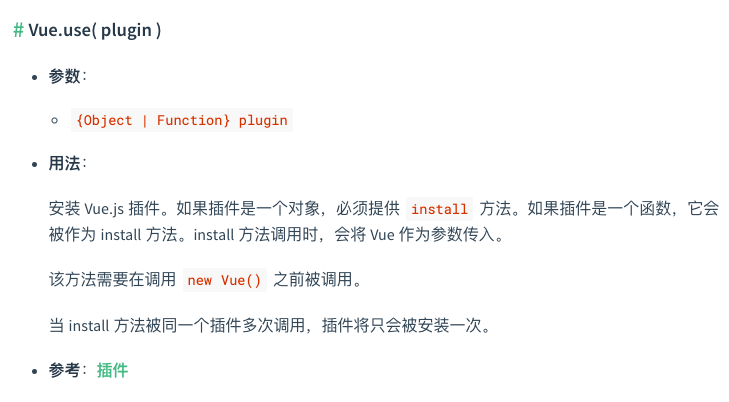

>无论是实现某个API, 还是新设计一个API, 都需要从这个API怎么使用来着手&nbsp;&nbsp;&nbsp;&nbsp;&nbsp;----鲁迅
## Vue-router基础用法
### 基础用法
```javascript
import Vue from 'vue'
import Router from 'vue-router'

Vue.use(Router)
const router = new Router({
  routes: [
    {
      path: '/',
      name: 'Home',
      component: Home
    },
    {
      path: '/about',
      name: 'About',
      component: () => import(/* webpackChunkName: "about" */ '../views/About.vue'),
      children: [
        {
          path: 'a',
          component: () => import('@/views/AboutA')
        }
      ]
    }
  ]
})
new Vue({
  router,
  render: h => h(App)
}).$mount('#app')
```
1. `vue.use()`如果参数为对象,就会调用该对象的install方法,所以Router对象上会有一个install方法。  
2. `new Router()`说明Vue-router导出一个类, 并且接收一个参数,参数目前看是一个对象
3. 挂载Router对象至Vue上

```vue
<template>
  <div class="about">
    <h1>This is an about page</h1>
    <router-link to="/about/a">AboutA</router-link>
    <router-view></router-view>
  </div>
</template>
```
4. `router-view`和`router-link`的使用

## Router.install
### Vue.use用法
Vue-router是作为Vue的插件来植入的,为了更好地理解,我们先来看一下`Vue.use()`的实现。  
下图是[官方文档](https://cn.vuejs.org/v2/api/#Vue-use)中关于`Vue.use()`的描述
  
能总结出来的几个特点:
1. 参数可以是Object/Function
2. 参数如果是Object需要提供install方法,如果是Function的话,则被当做install方法来执行
3. install方法调用会将Vue传入
4. 插件只会被安装一次(这个之后在install中实现)


### Vue.use源码
```typescript
//vue源码 src/global-api/use.ts
import type { GlobalAPI } from 'types/global-api'
import { toArray, isFunction } from '../util/index'

//Vue.use在initUse这个函数声明,Vue是在调用initUse时传入的
export function initUse(Vue: GlobalAPI) {
  Vue.use = function (plugin: Function | any) {
    /*不是关注重点,代码省略*/
    const args = toArray(arguments, 1)
    args.unshift(this) //this 指向 Vue 对象，通过unshift()可以保证数组参数第一个始终是vue对象
    if (isFunction(plugin.install)) {
      plugin.install.apply(plugin, args) //如果install存在并且是一个function,调用并传入Vue.use的参数args
    } else if (isFunction(plugin)) {
      plugin.apply(null, args) //如果plugin本身是函数,则直接调用,同样传入args
    }
    /*不是关注重点,代码省略*/
    return this
  }
}
```
### install
回到vue-router,我们导入vue-router之后,会使用`Vue.use(Router)`来注册路由这个插件(Vuex同理)。`Vue.use()`又会调用install方法    
所以Router对象需要声明一个install方法,并且第一个参数要传入Vue。

```typescript
//myRouter.js
import install from './install'

export default class myRouter {
  //核心:根据不同的路径跳转不同的页面/组件
  static install: () => {}
  options
  constructor(options) {
    this.options = options
  }
}
myRouter.install = install

//install.js
let _Vue
export default function install(Vue){
  //判断是否安装过此插件
  if(install.installed && _Vue === Vue) return
  //Vue.use(Router) → Router.install(Vue) → Router.install.installed = true
  //下次再使用Vue.use(Router),因为Router.install.installed === true,直接return
  install.installed = true
  _Vue = Vue
}
```

`install()`通过`Vue.mixin()`在每个组件上都挂载了_routerRoot属性, 指向根实例app;  
在根实例上还挂载了传入`new Vue()`的`$options.router`  
并调用了Router对象的init方法
```typescript
//install.js
let _Vue
export default function install(Vue){
  /*-----重复代码省略-----*/
  Vue.mixin({
    beforeCreate(){
      if(this.$options.router){//根组件执行
        //保存根实例
        this._routerRoot = this
        //保存根实例上的路由实例
        this._router = this.$options.router
        //
        this._router.init(this)
      }else{//非根组件执行
        //非根组件的_routerRoot属性都指向'#app'组件
        this._routerRoot = this.$parent && this.$parent._routerRoot
      }
    }
  })
}
```
:::warning
if里的this指向main.js文件里的初始化Vue的那个实例,else则指向各个Vue-component。
:::
这里通过`Vue.mixin()`来完成这个挂载的原因是:  
1. 不能通过传入的这个Vue来挂载,因为install执行的时机是`Vue.use()`调用的时候,而在这时,`new Vue()`还没有执行,路由配置router就没有挂载到Vue实例上,`$options`上就没有router属性
2. 为了获取new Vue()之后的`$options.router`,通过Vue.mixin()中this指向Vue实例这个特性,来找到`$options.router`


## Router的构造函数
### Router构建选项
`new Router()`初始化时接收一个[对象参数](https://v3.router.vuejs.org/zh/api/#router-%E6%9E%84%E5%BB%BA%E9%80%89%E9%A1%B9),本文聚焦于其中的[routes](https://v3.router.vuejs.org/zh/api/#routes)、[mode](https://v3.router.vuejs.org/zh/api/#mode)、[base](https://v3.router.vuejs.org/zh/api/#base)。

路由配置`routes`是一个数组,可包含[嵌套路由](https://v3.router.vuejs.org/zh/guide/essentials/nested-routes.html)配置,但这个数组对我们操作路由来说不是很方便,所以初始化时需要扁平化处理一下。处理这个步骤的核心方法就是`createMatcher`
```javascript
import createMatcher from './create-matcher'

export default class myRouter {
  //核心:根据不同的路径跳转不同的页面/组件
  static install: () => {}
  constructor(options) {
    this.mather = createMatcher(options.routes || [])
  }
  init(app){//app:根实例
  
  }
}
```
### createMatcher
`createMatcher`返回2个方法(源码中返回4个方法,这里简化了),addRoutes用来动态添加路由配置,math用来匹配路径;  
`createMatcher`中处理路由配置扁平化的方法为`createRouteMap`  
`match`方法在之后的History基类中会用到,这里先不讨论

create-matcher.js代码:  
```javascript
//create-matcher.js
import createRouteMap from './create-route-map'
import {createRoute} from '@/lib/utils/route'

export default function createMatcher(routes){
  //扁平化routes
  //将传入的routes转换成路径字符串和对应组件映射的数据结构
  let {pathList,pathMap} = createRouteMap(routes)
  
  //匹配路径,用location在pathMap里找到对应的记录
  //返回{path: '/about/a', matched: [About,AboutA]}
  function match (location) {
    let record = pathMap[location]
    let local = {
      path: location
    }
    if(record){
      return createRoute(record, local)
    }
    return createRoute(null, local)
  }
  
  function addRoutes (routes) {
    //添加新路由,需要将新添加的路由更新至pathList和pathMap中
    createRouteMap(routes, pathList, pathMap)
  }
  
  return {
    //源码中返回四个
    match,
    addRoutes
  }
}
```
### createRouteMap
`createRouteMap`处理路由配置,返回路由路径pathList和路由路径和路由其他信息的映射表pathMap;  
其中的`addRouteRecord`方法中, 定义了如何处理routes,然后生成pathList和pathMap;  
如果路由配置含有嵌套路由,递归执行`addRouteRecord`。  
  

create-route-map.js代码:  
```javascript
//create-route-map.js
export default function createRouteMap(routes,oldPathList,oldPathMap) {
  let pathList = oldPathList || []
  let pathMap = oldPathMap || Object.create(null)
  routes.forEach(route => {
    addRouteRecord(route, pathList, pathMap)
  })
  
  return {
    //pathList结构
    //['/','/about','/about/user1']
    pathList,
    //pathMap结构
    //{'/': record,'/about',record,'/about/user1',record}
    pathMap
  }
}

function addRouteRecord(route, pathList, pathMap, parent){
  //parent不存在: path = '/about'
  //parent存在: path = '/about/a'
  let path = parent ? `${parent.path}/${route.path}` :route.path
  let component = route.component
  //record中保存在路由的一些信息,源码中信息有很多,这里进行了简化
  let record = {
    path,
    component,
    parent
  }
  //路由初始化时,pathList和pathMap肯定是没有值的
  if(!pathMap[path]){
    pathList.push(path)
    pathMap[path] = record
  }
  //如果是嵌套路由
  if(route.children){
    route.children.forEach(child => {
      addRouteRecord(child, pathList, pathMap, record)
    })
  }
}
```
### mode选项
`new Router()`初始化时接收参数中,mode用来指定启用hash模式还是history模式(abstract本文不讨论)  
Router对象的构建选项中,会初始化一个值用来指定模式, 根据传入的mode值来分别使用HashHistory/H5History  
```javascript
import HashHistory from './history/HashHistory'
export default class myRouter {
  /*-----重复代码省略-----*/
  mode
  hitory
  constructor(options) {
    this.mode = options.mode || 'hash'
    this.history = new HashHistory(this)
  }
  
  /*-----重复代码省略-----*/
}
```
`HashHistory`类继承基类`History`,传入`new Router()`生成的实例
```javascript
//HashHistory.js
import History from './base'

export default class HashHistory extends History {
  constructor(router) {
    super(router)
  }
}
```
```javascript
//base.js
export default class History {
  constructor(router) {
    this.router = router
  }
}
```
### Router.init()
在路由初始化时,就使用到了`History类`  
我们在`Vue.use(Router)`时,执行了Router内部的`install`方法,`install`方法内部在根实例时又执行了Router对象的`init`方法。现在我们来看下init方法是怎么执行的。  
初始化时, 路由需要跳转到页面的入口并渲染响应组件, 我们定义一个`transitionTo`方法来实现  
`transitionTo`接收两个参数,路径和回调函数  

```javascript
/*-----重复代码省略-----*/
export default class myRouter {
  init(app){//根实例
    //根据当前路由,显示至指定组件
    const history = this.history
    const setupHashListener = () => {
      history.setupListeners()
    }
    history.transitionTo(
      history.getCurrentLocation(),
      setupHashListener
    )
  }
}
```
`transitionTo`是hash、history、abstract模式公共方法,定义在`base基类`上
内部根据路由地址location,通过Router对象上的`match`方法来匹配出对应的组件  
`base基类`内部维护一个`current`变量,用来保存当前的路径和组件信息  
在监听到hash变化时,找到新路径的对应信息,更新至`current`(后面会作相应的响应式处理)
```javascript
//base.js
import {createRoute} from '@/lib/utils/route'

export default class History {
  constructor(router) {
    this.router = router
    this.current = createRoute(null,{path: '/'})
  }
  //onComplete路由变化后的回调
  transitionTo(location, onComplete) {
    let newRoute = this.router.match(location)
    //这里进行了简化
    if(this.current.path === newRoute.path && this.current.matched.length === newRoute.matched.length) return
    this.updateRoute(newRoute)
    onComplete && onComplete()
  }
  updateRoute(route){
    this.current = route
  }
}
```
这里我们可以回到[*create-matcher*](#creatematcher)代码  
`match`方法根据传入的路径location,在pathMap中寻找对应路径的record记录  
返回`createRoute()`方法的结果
```javascript
//create-matcher.js
/*-----重复代码省略-----*/
  //匹配路径,用location在pathMap里找到对应的记录
  //返回{path: '/about/a', matched: [About,AboutA]}
  function match (location) {
    let record = pathMap[location]
    let local = {
      path: location
    }
    if(record){
      return createRoute(record, local)
    }
    return createRoute(null, local)
  }
/*-----重复代码省略-----*/
```
`createRoute`是一个工具函数  
核心逻辑是构造一个带有路径和路径对应record的数据结构  
特别是针对嵌套路由, 会将嵌套路由的组件依次放入matched数组中,之后依次渲染
```javascript
result = {
  location: '/about',
  matched: [
    {About:  About},
    {AboutA: AboutA}//about对应的component
  ]
}
```
```javascript
export function createRoute(record, location){
  let res = []
  if(record){
    while (record){
      res.unshift(record)
      record = record.parent
    }
  }
  return {
    ...location,
    matched: res
  }
}
```

在`init()`中,还有一个定义在`HashHistory类`上获取当前路由hash值的`getCurrentLocation`方法  
核心逻辑是获取`window.location.href`的值,并去除`#`之前的字符,得到路径  
这里不使用`window.location.hash`的原因是Firefox不支持
```javascript
//HashHistory.js
function getHash(){
  //'http://localhost:8080/#/about' → '/about'
  let href = window.location.href
  const index = href.indexOf('#')
  if(index < 0) return ''
  return href.slice(index + 1)
}

export default class HashHistory extends History {
  /*-----重复代码省略-----*/
  getCurrentLocation() {
    return getHash()
  }
}
```
`init()`中,`setupListeners`在源码中是定义在在`base基类`上,但是个空方法,在`HashHistory`继承基类时覆写这个方法,这里只实现其核心逻辑  
在`getCurrentLocation`执行完,设置hash值的监听器, 在我们改变URL时执行回调函数(也就是URL改变时渲染对应组件)
```javascript
export default class HashHistory extends History {
  /*-----重复代码省略-----*/
  setupListeners(){
    window.addEventListener('hashchange', () => {
      this.transitionTo(getHash())
    })
  }
}
```

### 路径的响应式
### 默认路径
当默认路径为空, 例如: `http://localhost:8080`时,页面不会跳转至默认组件,因为这时候我们启用的hash模式,默认路径为空并不能跳转至指定路径,也就不能渲染对应的组件。`HashHistory.js`需要再改造一下  
`ensureSlash()`用来判断获得的hash值第一个字符是否为`/`,如果不是`/`,调用`replaceHash('/'+ '')`,在HashHistory的构造函数中调用;    
`replaceHash()`替换路径  
`getUrl(path)`返回不带`#`的基础路径+path参数组合而成的路径
```javascript
//HashHistory.js
/*-----重复代码省略-----*/
function getHash(){
  //'http://localhost:8080/#/about' → '/about'
  let href = window.location.href
  const index = href.indexOf('#')
  if(index < 0) return ''
  return href.slice(index + 1)
}
function ensureSlash () {
  const path = getHash()
  if (path.charAt(0) === '/') {
    return true
  }
  replaceHash('/' + path)
  return false
}
function getUrl (path) {
  //getUrl('/')
  //http://localhost:8081/#/about → 'http://localhost:8081/#/'
  const href = window.location.href
  const i = href.indexOf('#')
  const base = i >= 0 ? href.slice(0, i) : href
  return `${base}#${path}`
}
function replaceHash (path) {
  //replaceHash('/')
  //'http://localhost:8081' → 'http://localhost:8081/#/'
  window.location.replace(getUrl(path))
}
```
通过以上代码,在路径发生变化时,路径和路径对应组件会成功保存/执行,但这时候页面还不会渲染  
原因是,保存当前路径信息的`current`只是维护在`base基类`内部,`Vue`并不能做出响应式的渲染  
我们在`Vue.mixin`时,对根实例新增一个私有属性`_route`,将`current`绑定在上面  
```javascript
//install.js
/*-----重复代码省略-----*/
Vue.mixin({
  beforeCreate() {
    if(this.$options.router){
      //使current称为响应式
      Vue.util.defineReactive(this, '_route', this._router.history.current)
    }else{
      /*-----重复代码省略-----*/
    }
  }
})
/*-----重复代码省略-----*/
```
`_router`是我们的Router对象,维护了`history`对象,`current`属性就保存在上面。  
再通过暴露`$route`和`$router`来提供访问
```javascript
//install.js
/*-----重复代码省略-----*/
Object.defineProperty(Vue.prototype, '$route', {
  get(){
    return this._routerRoot._route
  }
})
Object.defineProperty(Vue.prototype, '$router', {
  get(){
    return this._routerRoot._router
  }
})
/*-----重复代码省略-----*/
```
回到[*transitionTo*](#router-init),我们在根据路径更新`current`时需要一并更新`_route`  
```javascript
//myRouter.js
export default class myRouter {
  /*-----重复代码省略-----*/
  init(app){
    history.listen((route) => {
      app._route = route
    })
  }
  /*-----重复代码省略-----*/
}
```
```javascript
//base.js
/*-----重复代码省略-----*/
export default class History {
  constructor(router) {
    this.router = router
    this.current = createRoute(null, {path: '/'})
  }
  /*-----重复代码省略-----*/
  updateRoute(route){
    this.current = route
    this.cb && this.cb(route)
  }
  listen(cb){
    this.cb = cb
  }
}
/*-----重复代码省略-----*/
```
现在我们实现了`_route`的响应式, 之后在`RouterView`和`RouterLink`中我们就可以根据`_route`来渲染对应视图  

## router-view
利用函数式组件来创建`router-view`  
在`new Vue()`之前注册组件  
```javascript
//install.js
import RouterView from '@/lib/components/view'

export default function install(Vue){
  /*-----重复代码省略-----*/
  Vue.component('RouterView', RouterView)
}
```
```javascript
//RouterView.js
export default {
  name: 'RouterView',
  functional: true,
  render(h, {parent,data}){
    let route = parent.$route
    let matched = route.matched
    data.routerView = true
    let depth = 0
    
    while (parent){
      if(parent.$vnode && parent.$vnode.data.routerView){
        depth++
      }
      parent = parent.$parent
    }
    let record = matched[depth]
    if (!record) {
      return h()
    }
    return h(record.component, data)
  }
}

```
