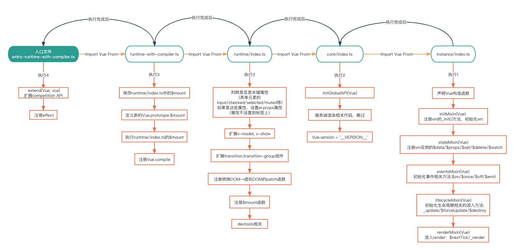

## 事前准备

### Fork代码

[Vue仓库地址](https://github.com/vuejs/vue)
作用：

1. 方便写自己注释
2. 方便便携demo,调试程序

### 项目结构

```
└── vue ································· project root
   ├─ benchmarks ········································· lib folder
   │  └─ index.js ································· entry file
   ├─ dist ····································· 打包产物
   ├─ examples ····································· 实例
   ├─ .gitignore ····································· git ignore file
   ├─ README.md ······································ repo readme
   └─ package.json ······································ package file
```
## 阅读源码前的一些Tips

#### "蔑视"源码
这里所说的蔑视不是说轻视源码的作用，而是在面对源码时不要过于害怕或者抵触。  
一开始很多新手(没错，我也是其中一员)开始看源码前，都会被源码的庞大和复杂所震慑，不敢或者不愿意去看源码。  
其实大可不必，源码阅读是需要一定前置知识和技巧的铺垫的，新手看不懂源码非常正常，不用为之苦恼，甚至觉得自己菜，自己不行啥的(别问我怎么知道的)。
#### 不要迷失在源码中
Vue, React等开源库的源码通常都很庞杂，里面充斥着各种边界情况的处理，工具函数的运用，看着看着你可能就不知道自己跳转到哪里去了，回头一想，又不知道自己看到哪儿了，也忘记了这个函数/变量是干嘛的。  
我个人(也是很多人推荐的)觉得，阅读源码，先要对他有一个整体的认识，了解他大概是由哪几部分组成的，入口文件在哪里，然后由入口文件去分析他各个模块的调用顺序(这个时候完全不用看具体实现)；这样就能了解一个大致的结构了。  
这时，我们再带着我们的目标--你想了解哪一部分的源码: 比如响应式系统，Set, nextTick等，再去对应的部分找具体的实现。  
这样做有几个好处:
1. 结构清晰，方便我们快速定位具体功能的代码实现
2. 大脑负担小，当我们设立了目标，其他不是目标的代码我们就可以忽略暂时不看
3. 这样做的一个过程，也是将一个复杂任务拆分成若干简单任务，让我们有看源码的动力和勇气

#### 关于调试
阅读源码的过程中，如果有任何不清楚的地方(比如某个变量是什么值，函数的调用位置等)，可以通过chrome给我们提供的工具来帮助我们更好的理解。  
在调试之前，我们需要先做几个准备工作：
1. 构建带有sourceMap的,Vue编译&运行时文件  
   在`scripts`命令中加上`--sourcemap`选项
```json
{
  "scripts": {
    "dev": "rollup -w -c scripts/config.js --environment TARGET:full-dev --sourcemap"
  }
}
```

2. 准备一个最起初的Vue起始文件。(带有`new Vue()`和`render()`函数，并且使用`$mount`执行渲染)。（随便渲染一个div即可）
3. 这里我们以寻找`Vue.prototype.$mount`的调用位置为例：  
   在chrome的源码标签页中，`Vue.prototype.$mount`的第一行代码上打上断点
   

然后我们刷新当前页面，进入调试模式  
在chrome调试工具右侧，可以找到调用栈的信息。大致长这样：  
  
从调用栈上，我们不难发现，`Vue.$mount`是在`Vue._init`方法中调用的，而`Vue._init`又是由Vue的构造函数调用的。`(anonymous)`表示匿名函数，点进去就能看到就是我们`new Vue()`时的代码。


## 寻找入口文件

在Vue源码中，它是由Rollup来进行打包的，`npm run dev`这条指令则指示了打包开发环境时所使用的js文件，通过查看这个文件，我们就能找到Vue源码的入口的文件。

```json
{
  "scripts": {
    "dev": "rollup -w -c scripts/config.js --environment TARGET:full-dev"
  }
}
```

可以看到，Rollup运行的打包文件是位于`script`目录下的`config.js`文件。
同时还传入了`TARGET`为`full-dev`

在`config.js`内，抛开定义各种变量，执行逻辑其实只有一个`if...else...`语句

```javascript
//config.js

//判断环境变量是否有TARGET
//getConfig()生成rollup配置文件
if (process.env.TARGET) {
  module.exports = genConfig(process.env.TARGET)
} else {
  exports.getBuild = genConfig
  exports.getAllBuilds = () => Object.keys(builds).map(genConfig)
}
```

`getConfig()`函数内，则通过`builds`这个对象来找到`full-dev`的选项

```javascript
//config.js

const builds = {
  /*-----代码省略-----*/
  // Runtime+compiler development build (Browser)
  'full-dev': {
    entry: resolve('web/entry-runtime-with-compiler.ts'),
    dest: resolve('dist/vue.js'),
    format: 'umd',
    env: 'development',
    alias: {he: './entity-decoder'},
    banner
  },
  /*-----代码省略-----*/
}

function genConfig(name) {
  const opts = builds[name]
  /*-----代码省略-----*/
}
```

从`full-dev`对象就可以找到入口文件，`entry-runtime-with-compiler.ts`了。(其他版本入口文件同理)


## Vue初始化过程

我们找到了编译的入口文件`entry-runtime-with-compiler.ts`，接下来就可以分析Vue初始化的大概流程了。  
一图胜千言，我总结了下这个流程：  



### runtime-with-compiler.ts

`entry-runtime-with-copiler.ts`文件中的内容很简单:

1. extend(Vue,vca)。vca就是vue3的composition API
2. Vue.effect = effect 也是vue3特性，这里只分析Vue2的代码，Vue3先略过
3. 导出Vue

Vue2部分的代码是由`runtime-with-compiler.ts`导入的。  
主要由几个部分组成:

1. `Vue.prototype.$mount`函数定义
2. `getOuterHTML()`函数定义
3. 导出Vue

我们这里先不详细看这些内容的详细代码，先分析出大致的脉络。具体的实现稍后再看。


先来看`$mount`  
判断el是否传入，并通过`query()`判断el是字符串还是DOM元素

```typescript
//runtime-with-compiler.ts
Vue.prototype.$mount = function (
  el?: string | Element,
  // 非ssr时为false，反之为true
  hydrating?: boolean
): Component {
  //获取el对象
  el = el && query(el)
}
```

```typescript
//util/index.ts
export function query(el: string | Element): Element {
  if (typeof el === 'string') {
    //el 为选择器
    const selected = document.querySelector(el)
    if (!selected) {
      __DEV__ && warn('Cannot find element: ' + el)
      return document.createElement('div')
    }
    return selected
  } else {
    //el为dom元素
    return el
  }
}
```

接下来判断el是否是`body`或者`html`

```typescript
// el 不能是body 或者 html
if (el === document.body || el === document.documentElement) {
  __DEV__ &&
  warn(
    `Do not mount Vue to <html> or <body> - mount to normal elements instead.`
  )
  return this
}
```

接下来获取Vue实例上的`$options`, 判断是否传入了`render()`函数,如果没传`render()`函数，就会将`template`转换成`render()`函数进行渲染（这里暂时不深入template部分的实现）。  
如果传入了`render()`函数则调用`mount()`函数渲染DOM。

```typescript

Vue.prototype.$mount = function (
  l?: string | Element,
  // 非ssr时为false，反之为true
  hydrating?: boolean
): Component {
  
  /*-----代码省略-----*/
  
  const options = this.$options
  //如果没有传入render函数，将template转换成render函数
  //如果传入了render函数，直接调用下面的mount方法
  if (!options.render) {
    let template = options.template
    if (template) {
      //do something
    } else if (el) {
      //do something
    }
    if (template) {
      //do something
    }
  }
  return mount.call(this, el, hydrate)
}
```
