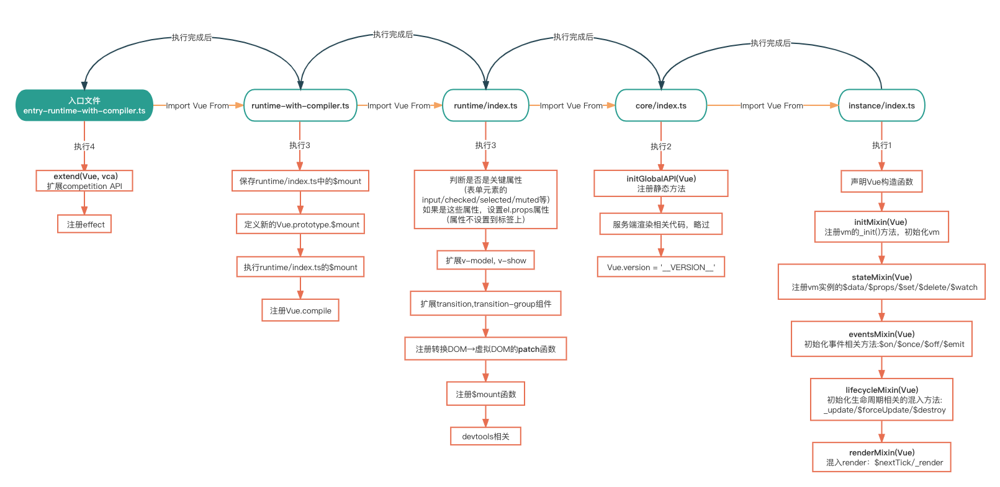

## 事前准备

### Fork代码

[Vue仓库地址](https://github.com/vuejs/vue)
作用：

1. 方便写自己注释
2. 方便便携demo,调试程序

### 项目结构[^1]

```
└── vue                  // project root
   ├─benchmarks          // 性能测试相关
   ├─dist                // 打包后的文件集合
   ├─flow                // flow类型声明
   ├─packages            // 与`vue`相关的一些其他的npm包, `vue-server-render`, `vue-template-compiler`等
   ├─scripts             // 构建相关的脚本
   ├─src                 // 源代码入口
   |  ├─shared           // 项目中用到的一些公共变量,方法等
   |  ├─sfc              // 用于处理单文件组件(.vue)解析的逻辑
   |  ├─server           // 服务端渲染相关的代码
   |  ├─platforms        // 不同平台之间的代码
   |  ├─core             // Vue的核心**运行时**代码
   |  |  ├─vdom          // 虚拟dom相关的代码
   |  |  ├─util          // Vue里用到的一些工具方法抽取
   |  |  ├─observer      // 实现响应式原理的代码
   |  |  ├─instance      // vue实例相关的核心逻辑
   |  |  ├─global-api    // 全局api Vue.extend, Vue.component等
   |  |  ├─components    // 内置的全局组件
   |  ├─compiler         // 与模板编译相关的代码
   ├─types               // Typescript类型声明
   ├─test                // 测试相关的代码

```

## 阅读源码前的一些Tips

### "蔑视"源码

这里所说的蔑视不是说轻视源码的作用，而是在面对源码时不要过于害怕或者抵触。  
一开始很多新手(没错，我也是其中一员)开始看源码前，都会被源码的庞大和复杂所震慑，不敢或者不愿意去看源码。  
其实大可不必，源码阅读是需要一定前置知识和技巧的铺垫的，新手看不懂源码非常正常，不用为之苦恼，甚至觉得自己菜，自己不行啥的(别问我怎么知道的)。

### 不要迷失在源码中

Vue, React等开源库的源码通常都很庞杂，里面充斥着各种边界情况的处理，工具函数的运用，看着看着你可能就不知道自己跳转到哪里去了，回头一想，又不知道自己看到哪儿了，也忘记了这个函数/变量是干嘛的。  
我个人(也是很多人推荐的)觉得，阅读源码，先要对他有一个整体的认识，了解他大概是由哪几部分组成的，入口文件在哪里，然后由入口文件去分析他各个模块的调用顺序(这个时候完全不用看具体实现)；这样就能了解一个大致的结构了。  
这时，我们再带着我们的目标--你想了解哪一部分的源码: 比如响应式系统，Set, nextTick等，再去对应的部分找具体的实现。  
这样做有几个好处:

1. 结构清晰，方便我们快速定位具体功能的代码实现
2. 大脑负担小，当我们设立了目标，其他不是目标的代码我们就可以忽略暂时不看
3. 这样做的一个过程，也是将一个复杂任务拆分成若干简单任务，让我们有看源码的动力和勇气

### 标记源码

在自己fork的源码中，在合适的地方打上log。这样一来代码的执行过程会比较清楚，二来在你复看源码时也会提供比较大的帮助。

### 关于调试

阅读源码的过程中，如果有任何不清楚的地方(比如某个变量是什么值，函数的调用位置等)，可以通过chrome给我们提供的工具来帮助我们更好的理解。  
在调试之前，我们需要先做几个准备工作：

1. 构建带有sourceMap的,Vue编译&运行时文件  
   在`scripts`命令中加上`--sourcemap`选项

```json
{
  "scripts": {
    "dev": "rollup -w -c scripts/config.js --environment TARGET:full-dev --sourcemap"
  }
}
```

2. 准备一个最起初的Vue起始文件。(带有`new Vue()`和`render()`函数，并且使用`$mount`执行渲染)。（随便渲染一个div即可）
3. 这里我们以寻找`Vue.prototype.$mount`的调用位置为例：  
   在chrome的源码标签页中，`Vue.prototype.$mount`的第一行代码上打上断点
   

然后我们刷新当前页面，进入调试模式  
在chrome调试工具右侧，可以找到调用栈的信息。大致长这样：  
  
从调用栈上，我们不难发现，`Vue.$mount`是在`Vue._init`方法中调用的，而`Vue._init`又是由Vue的构造函数调用的。`(anonymous)`表示匿名函数，点进去就能看到就是我们`new Vue()`时的代码。

## 寻找入口文件

在Vue源码中，它是由Rollup来进行打包的，`npm run dev`这条指令则指示了打包开发环境时所使用的js文件，通过查看这个文件，我们就能找到Vue源码的入口的文件。

```json
{
  "scripts": {
    "dev": "rollup -w -c scripts/config.js --environment TARGET:full-dev"
  }
}
```

可以看到，Rollup运行的打包文件是位于`script`目录下的`config.js`文件。
同时还传入了`TARGET`为`full-dev`

在`config.js`内，抛开定义各种变量，执行逻辑其实只有一个`if...else...`语句

```javascript
//config.js

//判断环境变量是否有TARGET
//getConfig()生成rollup配置文件
if (process.env.TARGET) {
  module.exports = genConfig(process.env.TARGET)
} else {
  exports.getBuild = genConfig
  exports.getAllBuilds = () => Object.keys(builds).map(genConfig)
}
```

`getConfig()`函数内，则通过`builds`这个对象来找到`full-dev`的选项

```javascript
//config.js

const builds = {
  /*-----代码省略-----*/
  // Runtime+compiler development build (Browser)
  'full-dev': {
    entry: resolve('web/entry-runtime-with-compiler.ts'),
    dest: resolve('dist/vue.js'),
    format: 'umd',
    env: 'development',
    alias: {he: './entity-decoder'},
    banner
  },
  /*-----代码省略-----*/
}

function genConfig(name) {
  const opts = builds[name]
  /*-----代码省略-----*/
}
```

从`full-dev`对象就可以找到入口文件，`entry-runtime-with-compiler.ts`了。(其他版本入口文件同理)

## Vue初始化过程

我们找到了编译的入口文件`entry-runtime-with-compiler.ts`，接下来就可以分析Vue初始化的大概流程了。  
一图胜千言，我总结了下这个流程：  


打包的过程中，遇到`import`会先进入被引入的模块，执行里面的内容。  
所以图中的引用关系，由最里层的`instance/index.ts`开始，逐步向外执行。打印信息也印证了这一点：  


## new Vue()过程

Vue的初始化过程在真正创建Vue实例之前，做了一些准备、铺垫工作，当然包括Vue的构造函数。
在`instance/index.ts`定义了Vue的构造函数，我们在`new Vue()`时，就执行这个构造函数

```javascript
function Vue(options) {
  if (__DEV__ && !(this instanceof Vue)) {
    warn('Vue is a constructor and should be called with the `new` keyword')
  }
  this._init(options)
}
```

使用函数来作为构造器是因为这样方便在Vue的原型上添加方法、属性。

在这个构造函数中又会执行`_init()`
,篇幅原因源码就不放在这里了，[点击这里查看(附带中文注释)](https://github.com/KKandLL-Forever/vue2-core/blob/wk-study/src/core/instance/init.ts)。  
`_init`是源码中非常重要的一个函数，他的执行过程如下图：


其中选项合并、注册各种方法和属性的初始化方法我们先按下不表，先来看下`$mount`
的内部实现。[源码在这。](https://github.com/KKandLL-Forever/vue2-core/blob/wk-study/src/platforms/web/runtime-with-compiler.ts)

`runtime-with-compiler.ts`中的`$mount()`运行逻辑如下图所示：


需要注意的是，在`runtime-with-compiler.ts`和`runtime/index.ts`有两处地方都注册了`$mount()`
方法，原因是：Vue源码打包时会分别生成编译时+运行时和运行时等多个版本的代码。如果只在上述文件中一个地方注册`$mount()`那肯定是不行的，所以在运行时版本中会先定义一次`$mount()`
版本，在编译时+运行时版本中则会保存运行时版本中定义的`$mount()`方法，然后覆写`$mount()`方法，并在覆写后的`$mount()`的最后调用运行时注册的`$mount()`方法。

```typescript
//runtime/index.ts
Vue.prototype.$mount = function (
  el?: string | Element,
  hydrating?: boolean
): Component {
  //这里再次获取el的原因是
  //如果我们使用的不是运行编译时版本
  //那mount时会直接执行这个$mount
  el = el && inBrowser ? query(el) : undefined
  return mountComponent(this, el, hydrating)
}
```

```typescript
//runtime-with-compiler.ts

//保存 Vue.prototype.$mount 方法
const mount = Vue.prototype.$mount
//相比runtime/index.ts中的$mount新增将template编译成render函数的部分
Vue.prototype.$mount = function (
  el?: string | Element,
  hydrating?: boolean
): Component {
  // ...
  // ...
  return mount.call(this, el, hydrating)
}
```

所以，挂载的关键函数就是`mountComponent`

```typescript
export function mountComponent(
  vm: Component,
  el: Element | null | undefined,
  hydrating?: boolean
): Component {
  vm.$el = el
  //没有传入render函数，会赋值createEmptyVNode方法
  if (!vm.$options.render) {
    vm.$options.render = createEmptyVNode
    //runtime版本下，如果传入了template，会警告⚠️
    //...
  }
  callHook(vm, 'beforeMount')
  
  let updateComponent //这里只是定义,执行在Wather中
  if (__DEV__ && config.performance && mark) {
    //性能检测代码，忽略
  } else {
    //_render 使用用户传入的render, 或者没传render时vue生成的render。最终返回虚拟dom
    //_update 将传入的虚拟dom转换成真实dom，渲染到界面上
    updateComponent = () => {
      vm._update(vm._render(), hydrating)
    }
  }
  new Watcher(
    vm,
    updateComponent,
    noop,
    watcherOptions,
    true
  )
  //...
}
```

`mountComponent`会先判断实例的`$options`是否存在render函数，如果不存在则会告警；之后调用生命周期钩子`beforeMount`;注册`updateComponent`
函数，在这个函数中，调用实例上的`_update()`函数，转换`_render()`生成的虚拟dom为真实dom,渲染到界面上。  
这里定义了`updateComponent`，调用是在之后的`watcher`类中，之后在响应式系统的部分我们在来看`watcher`部分的代码，这里只要知道更新视图实在`watcher`中执行的就可以了。  
最后会触发生命周期函数`mounted`，并返回vm实例。


## 参考文章
[^1]:[Vue2.x 源码学习系列-目录结构介绍](https://juejin.cn/post/7012417885624598564)


[//]: # (判断el是否传入，并通过`query&#40;&#41;`判断el是字符串还是DOM元素)

[//]: # ()

[//]: # (```typescript)

[//]: # (//runtime-with-compiler.ts)

[//]: # (Vue.prototype.$mount = function &#40;)

[//]: # (  el?: string | Element,)

[//]: # (  // 非ssr时为false，反之为true)

[//]: # (  hydrating?: boolean)

[//]: # (&#41;: Component {)

[//]: # (  //获取el对象)

[//]: # (  el = el && query&#40;el&#41;)

[//]: # (})

[//]: # (```)

[//]: # ()

[//]: # (```typescript)

[//]: # (//util/index.ts)

[//]: # (export function query&#40;el: string | Element&#41;: Element {)

[//]: # (  if &#40;typeof el === 'string'&#41; {)

[//]: # (    //el 为选择器)

[//]: # (    const selected = document.querySelector&#40;el&#41;)

[//]: # (    if &#40;!selected&#41; {)

[//]: # (      __DEV__ && warn&#40;'Cannot find element: ' + el&#41;)

[//]: # (      return document.createElement&#40;'div'&#41;)

[//]: # (    })

[//]: # (    return selected)

[//]: # (  } else {)

[//]: # (    //el为dom元素)

[//]: # (    return el)

[//]: # (  })

[//]: # (})

[//]: # (```)

[//]: # (接下来判断el是否是`body`或者`html`)

[//]: # ()

[//]: # (```typescript)

[//]: # (// el 不能是body 或者 html)

[//]: # (if &#40;el === document.body || el === document.documentElement&#41; {)

[//]: # (  __DEV__ &&)

[//]: # (  warn&#40;)

[//]: # (    `Do not mount Vue to <html> or <body> - mount to normal elements instead.`)

[//]: # (  &#41;)

[//]: # (  return this)

[//]: # (})

[//]: # (```)

[//]: # ()

[//]: # (接下来获取Vue实例上的`$options`, 判断是否传入了`render&#40;&#41;`函数,如果没传`render&#40;&#41;`函数，就会将`template`转换成`render&#40;&#41;`函数进行渲染（这里暂时不深入template部分的实现）。  )

[//]: # (如果传入了`render&#40;&#41;`函数则调用`mount&#40;&#41;`函数渲染DOM。)

[//]: # ()

[//]: # (```typescript)

[//]: # ()

[//]: # (Vue.prototype.$mount = function &#40;)

[//]: # (  l?: string | Element,)

[//]: # (  // 非ssr时为false，反之为true)

[//]: # (  hydrating?: boolean)

[//]: # (&#41;: Component {)

[//]: # (  )

[//]: # (  /*-----代码省略-----*/)

[//]: # (  )

[//]: # (  const options = this.$options)

[//]: # (  //如果没有传入render函数，将template转换成render函数)

[//]: # (  //如果传入了render函数，直接调用下面的mount方法)

[//]: # (  if &#40;!options.render&#41; {)

[//]: # (    let template = options.template)

[//]: # (    if &#40;template&#41; {)

[//]: # (      //do something)

[//]: # (    } else if &#40;el&#41; {)

[//]: # (      //do something)

[//]: # (    })

[//]: # (    if &#40;template&#41; {)

[//]: # (      //do something)

[//]: # (    })

[//]: # (  })

[//]: # (  return mount.call&#40;this, el, hydrate&#41;)

[//]: # (})

[//]: # (```)
