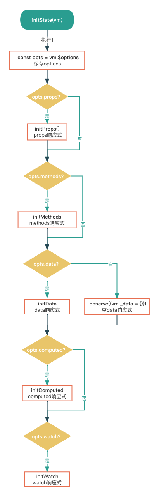

在[Vue2源码系列-起手式](https://kkanll.wang/posts/2022-06-07-vue-reactive.html)中，我们分析了入口文件，Vue初始化之前和Vue初始化的执行过程，在Vue实例初始化`_init`函数中，进行了很多初始化操作，其中`initState`函数则对响应式数据props,methods,data,computed,watcher进行了初始化。这篇文章就从`initState`函数中对data的响应式处理为切入点，来学习了解Vue的响应式系统的大致构建过程。

## 响应式入口

### initState
我们先来看下`initState`函数的执行过程，过程并不复杂，逻辑也很清晰：

总结一下`initState`做的几件事：
1. props响应式处理
2. methods响应式处理
3. data响应式处理
4. computed响应式处理
5. watch响应式处理

::: details 查看initState源码.
```typescript
export function initState(vm: Component) {
  const opts = vm.$options
  if (opts.props) initProps(vm, opts.props)
  
  // Composition API
  initSetup(vm)
  
  if (opts.methods) initMethods(vm, opts.methods)
  if (opts.data) {
    initData(vm)
  } else {
    const ob = observe((vm._data = {}))
    ob && ob.vmCount++
  }
  if (opts.computed) initComputed(vm, opts.computed)
  if (opts.watch && opts.watch !== nativeWatch) {
    initWatch(vm, opts.watch)
  }
}
```
:::
### initData
`initData`的逻辑也不复杂，主要是获取data函数返回的值，data属性校验，响应式处理：


::: details 查看initData源码.
```typescript
function initData(vm: Component) {
  
  let data: any = vm.$options.data
  // 初始化 _data，组件中 data 是函数，调用函数返回结果 否则直接返回 data
  data = vm._data = isFunction(data) ? getData(data, vm) : data || {}
  if (!isPlainObject(data)) {
    data = {}
    __DEV__ &&
    warn(
      'data functions should return an object:\n' +
      'https://vuejs.org/v2/guide/components.html#data-Must-Be-a-Function',
      vm
    )
  }
  // proxy data on instance
  // 获取 data 中的所有属性
  const keys = Object.keys(data)
  // 获取 props / methods
  const props = vm.$options.props
  const methods = vm.$options.methods
  let i = keys.length
  // 判断 data 上的成员是否和  props/methods 重名
  while (i--) {
    const key = keys[i]
    if (__DEV__) {
      // 命名不能和方法重复
      if (methods && hasOwn(methods, key)) {
        warn(`Method "${key}" has already been defined as a data property.`, vm)
      }
    }
    // 命名不能和props重复
    if (props && hasOwn(props, key)) {
      __DEV__ &&
      warn(
        `The data property "${key}" is already declared as a prop. ` +
        `Use prop default value instead.`,
        vm
      )
    } else if (!isReserved(key)) {
      // proxy 会对 data 做一层代理，直接通过 vm.XXX 可以代理访问到 vm._data 上挂载的对 象属性。
      proxy(vm, `_data`, key)
    }
  }
  
  // observe data
  // 响应式处理
  const ob = observe(data)
  ob && ob.vmCount++
}
export function getData(data: Function, vm: Component): any {
  // #7573 disable dep collection when invoking data getters
  pushTarget()
  try {
    return data.call(vm, vm)
  } catch (e: any) {
    handleError(e, vm, `data()`)
    return {}
  } finally {
    popTarget()
  }
}
```
:::
其中获取data函数的值也就是`getData`这个函数的实现，值得细品一下。  
`getData`函数中，核心就一句话：

```typescript
function getData(data: Function, vm: Component): any {
//...
  return data.call(vm, vm)
//...
}
```
`getData`只会在data是函数时触发，其中包含了几点信息：  
1. 根实例传入的data因为是对象，不会调用getData()
2. 这里其实也印证了"组件中的data是一个函数"，组件中data函数返回一个对象，这里`data.call`调用后，就能获取到我们定义的data对象了。

## observe
1. 判断是否非对象/Ref/VNode，是则直接return
2. 判断是否有'__ob__'属性（有的话说明已经被响应式处理过了），有的话ob等于__ob__的值
如果没有的话还要判断几个条件：
   - shouldObserve,这个属性是通过toggleObserving函数改变的，有些情况下我们并不想响应式处理时调用此函数改变shouldObserve
   - isServerRendering 是否是ssr
   - 是否是数组或者纯对象
   - Object.isExtensible判断对象是否可扩展，也就是是否能添加__ob__属性
   - vue实例不需要响应式处理
3. 实例化Observer
::: details 查看observe源码
```typescript
export function observe(value: any, shallow?: boolean): Observer | void {
  // 判断 value 是否是对象
  if (!isObject(value) || isRef(value) || value instanceof VNode) return
  let ob: Observer | void
  // 如果 value 有 __ob__(observer对象) 属性
  if (hasOwn(value, '__ob__') && value.__ob__ instanceof Observer) {
    ob = value.__ob__
  } else if (
    shouldObserve &&
    !isServerRendering() &&
    (isArray(value) || isPlainObject(value)) &&
    Object.isExtensible(value) &&
    !value.__v_skip //如果是vue实例不需要响应式处理
  ) {
    // 创建一个 Observer 对象
    ob = new Observer(value, shallow)
  }
  return ob
}
```
:::

## Observer
实例化过程
1. 实例化Dep类
2. def函数为传进来的对象(constructor的参数value必然是对象，因为在observe中已经过滤了)，设置__ob__属性并设置它的值为Observer实例
3. value如果为数组，调用observeArray函数（之后再讲数组）
4. 其他对象，调用walk函数遍历每个属性

::: details 查看Observer源码
```typescript
export class Observer {
  // 管理依赖的Dep类
  dep: Dep
  // 实例计数器
  vmCount: number // number of vms that have this object as root $data
  
  constructor(public value: any, public shallow = false) {
    // this.value = value
    this.dep = new Dep()
    this.vmCount = 0
    // 将实例挂载到观察对象的 __ob__ 属性
    def(value, '__ob__', this)
    // 数组的响应式处理
    if (isArray(value)) {
      if (hasProto) {
        protoAugment(value, arrayMethods)
      } else {
        copyAugment(value, arrayMethods, arrayKeys)
      }
      if (!shallow) {
        this.observeArray(value)
      }
    } else {
      // 遍历对象中的每一个属性，转换成 setter/getter
      this.walk(value, shallow)
    }
  }
  
  walk(obj: object, shallow: boolean) {
    // 获取观察对象的每一个属性
    const keys = Object.keys(obj)
    // 遍历每一个属性，设置为响应式数据
    for (let i = 0; i < keys.length; i++) {
      const key = keys[i]
      defineReactive(obj, key, NO_INIITIAL_VALUE, undefined, shallow)
    }
  }
  
  observeArray(items: Array<any>) {
    for (let i = 0, l = items.length; i < l; i++) {
      observe(items[i])
    }
  }
}

```
:::

### defineReactive
### 数组的响应式
## Dep


