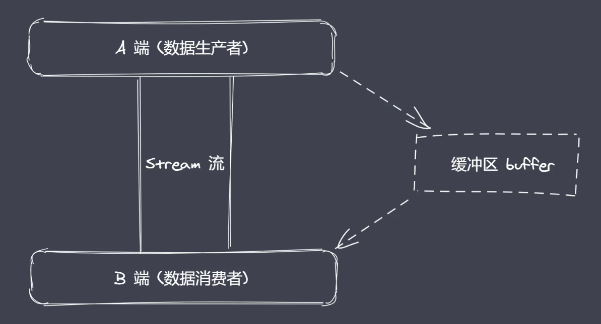

## 核心模块-path
basename() 荻取路径中基础名称  
```typescript
let path = require('path')
console.log(__filename)
console.log(path.basename(__filename))
console.log(path.basename(__filename,'.js'))
console.log(path.basename(__filename,'.css'))
console.log(path.basename('/a/b/c'))
console.log(path.basename('/a/b/c/'))
//D:\Desktop\Nodejs\Code\06-path. js
//06-path.js
//06-path
//06-path.js
//c
//c
```
dirname() 获取路径中目录名称  
```typescript
let path = require('path')
console.log(path.dirname(__filename))
console.log(path.dirname('/a/b/c'))
console.log(path.dirname('/a/b/c/'))
//D: \Desktop\Nodejs\Code 目录路径
// /a/b
// /a/b
```
extname() 获取路径中扩展名称  
```typescript
let path = require('path')
console.log(path.dirname(__filename))
console.log(path.dirname('/a/b/c'))
console.log(path.dirname('/a/b/index.html.css.js.scss'))
console.log(path.dirname('/a/b/index.html.css.js.'))
// .js
// (空)
// .scss
// .
```
parse() 解析路径
```typescript
let path = require('path')
console.log(path.parse('/a/b/index.html'))
/*
{
  root: '/',
  dir: '/a/b',
  base: 'index.html',
  ext: '.html',
  name: 'index'
}
*/
console.log(path.parse('./a/b/index.html'))
/*
{
  root: '',
  dir: '/a/b',
  base: 'index.html',
  ext: '.html',
  name: 'index'
}
*/
```
format() 序列化路径
```typescript
let path = require('path')
let obj = path.parse('./a/b/index.html')
console.log(path.format(obj))
// './a/b/index.html'
```
isAbsolute() 获取路径是否为绝对路径  
```typescript
let path = require('path')
console.log(path.isAbsolute('/foo'))
console.log(path.isAbsolute('///foo'))
console.log(path.isAbsolute('./foo'))
console.log(path.isAbsolute('.'))
console.log(path.isAbsolute(''))
console.log(path.isAbsolute('../foo'))
// true
// true
// false
// false
// false
// false
```
join() 拼接多个路径片段
```typescript
let path = require('path')
console.log(path.join('a/b', 'c', 'index.html'))
console.log(path.join('/a/b', 'c', 'index.html'))
console.log(path.join('/a/b', 'c', '../', 'index.html'))
console.log(path.join('/a/b', 'c', './', 'index.html'))
// a/b/c/index.html
// /a/b/c/index.html
// /a/b/index.html
// /a/b/c/index.html
```
normalize(() 规范化路径
```typescript
let path = require('path')
console.log(path.normalize(''))
console.log(path.normalize('a/b/c'))
console.log(path.normalize('a//////b..../c'))
console.log(path.normalize('a/\d/b../c'))
// .
// a/b/c/
// a/b..../c/
// a/d/b..../c/
```
resolve() 返回绝对路径
```typescript
let path = require('path')
console.log(path.resolve())
console.log(path.resolve('index.html'))
// '/Users/wangkai/FrontEnd/yew-app-try'
// '/Users/wangkai/FrontEnd/yew-app-try/index.html'
```

## Buffer
#### 二进制数据
文件的读写，网络的服务等使用的大多都是二进制数据。
在计算机眼里，无论是看到的听到的，亦或是我们写的代码其实都是"一串数字"，它也只认识这些数字。
#### 流操作
可中断，配合管道技术可以实现数据分段传输
#### Buffer
NodeJs全局变量
用于NodeJs平台下的二进制数据操作
不占用v8的内存空间，额外有一出内存空间来存放Buffer
还是由NodeJs来控制，垃圾回收也是由v8来控制
一般配合stream使用，充当数据缓冲区


#### Buffer.alloc()
```javascript
let buffer = Buffer.alloc(10)
console.log(buffer)
// Buffer[00,00,00,00,00,00,00,00,00,00]
```
#### Buffer.from(data, encode)
可以接受三种数据类型：string、数组、buffer
默认encode是`utf8`格式
生成的buffer默认十六进制
```javascript
Buffer.from('凯')
// <Buffer e5 87 af>
```
数组中不要传中文，不识别
```javascript
Buffer.from(['凯'])
// <Buffer 00>

// 这里0207是87的八进制表示，其他则是16进制
Buffer.from([0xe5, 0207, 0xaf])
// <Buffer e5 87 af>
Buffer.from([0xe5, 0207, 0xaf]).toString()
// '凯'
```

::: tip
```javascript
let b = Buffer.alloc(3)
let b2 = Buffer.from(b)
// <Buffer 00 00 00>
// <Buffer 00 00 00>

b[0] = 1
// <Buffer 01 00 00>
// <Buffer 00 00 00>
```
有类似于"深拷贝"的意思，也就是`Buffer.from`只会利用`alloc`生成的内存空间"长度"，而不是简单的共享一个内存
:::

### Buffer的实例方法
#### fill


#### write
#### toString
#### slice
#### indexOf
#### copy


